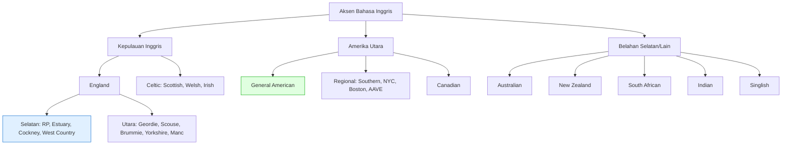
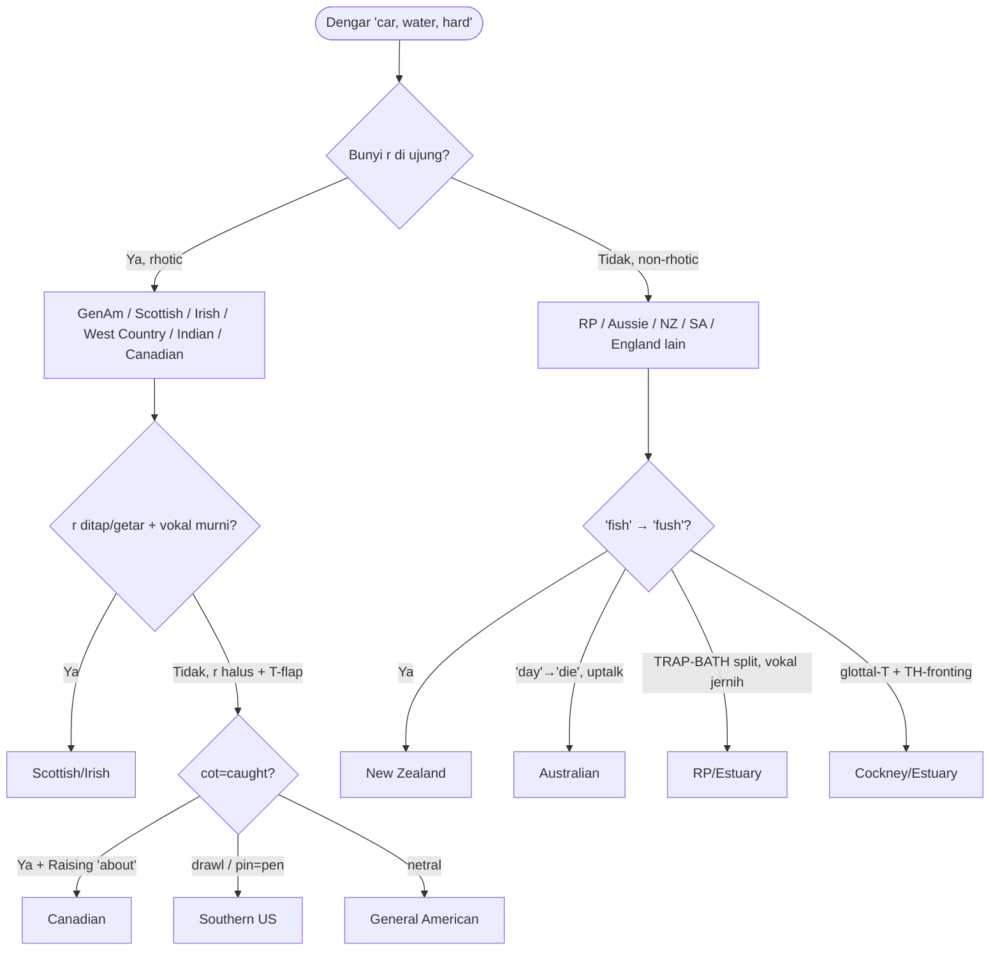

# 🌍 Atlas Aksen Bahasa Inggris — Lengkap

### Dari RP sampai Singlish: semua aksen besar, ciri pembeda, + contoh IPA

> Lanjutan dari `silabus-british-rp.md` & `silabus-american.md`.
> File itu ngajarin **cara ngucap** (RP & GenAm). File ini ngajarin **cara membedakan
> & mengenali SEMUA aksen** — biar kamu paham kenapa orang Inggris, Skotlandia,
> Amerika Selatan, Australia kedengeran beda padahal bahasa sama.

---

## 📌 Cara Pakai File Ini

1. **Jangan hafal semua aksen.** Kamu cukup **kuasai 1 buat ditiru** (RP atau GenAm) +
   **kenali sisanya** (buat listening: film, podcast, interview kerja, IELTS listening).
2. Baca **BAGIAN 1 dulu** (sumbu pembeda). Itu kerangka. Tanpa itu, tiap aksen kelihatan
   acak. Dengan itu, tiap aksen = kombinasi setelan yang bisa diprediksi.
3. Ikon prioritas:
   - 🔴 **WAJIB kenali** — sering muncul di media/ujian, gampang salah paham
   - 🟡 **BERGUNA** — nambah telinga, bikin listening tajam
   - 🟢 **NICHE** — buat yang penasaran / niat serius
4. Format tiap aksen = **kartu profil**: ciri utama → vokal/konsonan khas → contoh IPA →
   frasa penanda → referensi media → tingkat kesulitan ditiru.

---

## 🗺️ Peta Dunia Aksen

---

# BAGIAN 1 — Sumbu Pembeda Aksen 🔴

**INI KERANGKANYA.** Semua aksen = kombinasi ±10 "setelan" ini. Kuasai ini, kamu bisa
"membaca" aksen apa pun.

## 1.1 Rhoticity (paling penting) 🔴

Apakah huruf `r` di akhir/sebelum konsonan **diucapkan**?

| | Rhotic (r diucap) | Non-rhotic (r hilang) |
|---|---|---|
| `car` | /kɑːr/ | /kɑː/ |
| `hard` | /hɑːrd/ | /hɑːd/ |
| `mother` | /ˈmʌðər/ | /ˈmʌðə/ |
| **Aksen** | GenAm, Skotlandia, Irlandia, West Country, Kanada, India | RP, Australia, NZ, Afrika Selatan, mayoritas England, NYC & Boston tradisional |

> **Trik dengar:** dengar kata "car/far/water". Ada bunyi `r` di ujung? → rhotic (Amerika-ish).
> Hilang, jadi vokal panjang doang? → non-rhotic (British-ish).

## 1.2 TRAP–BATH Split 🔴

Kata `bath, class, dance, can't, laugh`: pakai vokal **pendek /æ/** atau **panjang /ɑː/**?

- **/ɑː/** (bahth): RP, England Selatan, Australia, NZ, Afrika Selatan.
- **/æ/** (baeth): **GenAm**, England Utara (!), Skotlandia, Irlandia.

Ini kenapa orang Amerika & orang Manchester sama-sama bilang `bath` = /bæθ/, beda dari London.

## 1.3 FOOT–STRUT Split 🟡

Kata `cut, but, love, luck` vs `put, foot, book`:

- **Ada split**: `cut` /kʌt/ ≠ `put` /pʊt/ → RP, GenAm, Selatan.
- **Tanpa split**: `cut` = `put` = /kʊt/ → **England Utara** (Manchester, Yorkshire, Geordie).
  Orang Utara bilang "one" seperti "wun"→"woon".

> Satu tes cepat bedain Utara vs Selatan England: minta orang baca "butter". Selatan = /ˈbʌtə/,
> Utara = /ˈbʊtə/.

## 1.4 Cot–Caught Merger 🟡

`cot` /ɒ~ɑ/ vs `caught` /ɔː/ — **sama atau beda**?

- **Beda**: RP, NYC, Australia.
- **Sama (merged)**: mayoritas GenAm, Kanada, Skotlandia. `cot` = `caught`.

## 1.5 Vokal LOT 🟡

`lot, hot, dog`:
- **/ɒ/ bulat** (bibir maju): RP, Aussie.
- **/ɑː/ terbuka tak bulat**: GenAm (`hot` kedengeran "haht").

## 1.6 Yod-dropping 🟡

`new, tune, duke, student` — ada bunyi `/j/` (y) sebelum /uː/?

- **/njuː/ (nyoo)**: RP.
- **/nuː/ (noo)**: GenAm (drop yod).

## 1.7 T-flapping / T-glottalization 🟡

Bunyi `t` di tengah kata (`water, better, city`):
- **Flap /ɾ/** (jadi kayak `d` cepat): GenAm, Australia. `water` → "wader".
- **Glottal stop /ʔ/** (ditelan): Cockney, Estuary, Glasgow. `water` → "wa'er".
- **/t/ jelas**: RP konservatif, India.

## 1.8 TH sounds 🔴

`think /θ/`, `this /ð/` — sering jadi penanda aksen/kelas:
- **/θ ð/ murni**: RP, GenAm standar.
- **TH-fronting → /f v/**: Cockney, Estuary, AAVE. `think`→"fink", `brother`→"bruvver".
- **TH-stopping → /t d/**: Irlandia, India, Karibia, AAVE, penutur Indonesia. `think`→"tink".

## 1.9 H-dropping 🟡

`house, happy` — huruf `h` di awal diucap?
- **Dijaga**: RP, GenAm.
- **Dibuang**: Cockney & banyak England kelas pekerja. `house`→"'ouse".

## 1.10 L-vocalization 🟡

Dark-L di akhir (`milk, ball, full`) berubah jadi vokal /o~w/:
- Cockney/Estuary: `milk`→"miwk" /mɪok/, `ball`→"baw".

## 1.11 Ritme: Stress-timed vs Syllable-timed 🔴

- **Stress-timed** (native inti): suku ditekan jaraknya rata, sisanya di-schwa & dipepet.
  RP, GenAm, Aussie.
- **Syllable-timed** (tiap suku durasi ~sama, "tak-tak-tak"): India, Singlish, Karibia,
  **penutur Indonesia**. Ini yang bikin aksen non-native kedengeran "kaku/robot".

> 📊 **Ringkas:** aksen = ceklis 11 setelan di atas. Contoh "resep":
> - **GenAm** = rhotic + TRAP/æ + cot-caught merge + yod-drop + T-flap.
> - **RP** = non-rhotic + TRAP-BATH split + cot-caught beda + yod-keep + T jelas.
> - **Cockney** = non-rhotic + TH-fronting + H-drop + glottal-T + L-vocalization.

---

# BAGIAN 2 — Aksen England 🔴

## 2.1 RP / Estuary (Selatan) — *rujuk `silabus-british-rp.md`*

Udah dibahas tuntas di file RP. Ringkas penanda: non-rhotic, TRAP-BATH split, vokal jelas.
**Estuary** = RP yang lebih santai + sedikit glottal-T & L-vocalization. Aksen "netral London"
paling umum sekarang (penyiar muda, profesional).

## 2.2 🔴 Cockney (London kelas pekerja timur)

| Aspek | Detail |
|---|---|
| **Ciri utama** | TH-fronting, H-drop, glottal-T, L-vocalization |
| **Vokal khas** | FACE /æɪ/ (day→"dai"), PRICE /ɑɪ/ (my→"moi"-ish), MOUTH /æʊ/, GOAT /ʌʊ/ |
| **Contoh** | `think` /fɪŋk/ · `house` /ˈæʊs/ (h-drop) · `butter` /ˈbʌʔə/ · `milk` /mɪok/ |
| **Frasa penanda** | *"Have a butcher's"* (look) · rhyming slang · *"innit?"* |
| **Media** | Adele, film *Lock, Stock*; karakter *EastEnders* |
| **Tiru?** | 🟢 niche — buat listening, jangan buat IELTS |

> Efek kombinasi: kalimat *"I think he's got a bottle of water"* → "I **f**ink 'e's go**'** a bo**'**le of wa**'**er". Glottal-T di mana-mana.

## 2.3 🟡 West Country (Bristol, Somerset, Devon, Cornwall)

| Aspek | Detail |
|---|---|
| **Ciri utama** | **RHOTIC** (jarang di England!) — `r` diucap kuat, retrofleks kayak Amerika |
| **Konsonan khas** | S awal jadi Z: `Somerset`→"Zomerzet", `farmer`→"varmer" (tradisional) |
| **Contoh** | `farm` /fɑːrm/ (bukan /fɑːm/) · `card` /kɑːrd/ |
| **Frasa** | *"Where's it to?"* (di mana), *"my lover"* (sapaan) |
| **Media** | bajak laut stereotip ("arr!"), Hagrid (*Harry Potter*) |
| **Tiru?** | 🟢 niche |

## 2.4 🔴 Geordie (Newcastle, Timur Laut)

| Aspek | Detail |
|---|---|
| **Ciri utama** | vokal unik, intonasi sangat naik-turun (musikal) |
| **Vokal khas** | `town`→/tuːn/ ("toon"), FACE = /eː/ monophthong ("make"→"mek"/"mayk"), GOAT /oː/ |
| **Contoh** | `no`→"noo" · `home`→"hyem" · `work`→"wark" |
| **Frasa** | *"Why aye, man!"* (ya tentu), *"canny"* (bagus), *"howay"* (ayo) |
| **Media** | Cheryl Cole, *Geordie Shore*, Ant & Dec |
| **Tiru?** | 🟢 niche — tapi sering muncul reality TV |

## 2.5 🟡 Scouse (Liverpool)

| Aspek | Detail |
|---|---|
| **Ciri utama** | /k/ akhir jadi frikatif /x/~/k̠/, nada adenoidal (agak "sengau") |
| **Konsonan khas** | `back`→/bax/, `chicken`→"chi**h**en"; TH kadang →/t d/ |
| **Vokal khas** | NURSE fronted /ɛː/: `bird`→"behd", `her`→"hair"-ish |
| **Frasa** | *"boss"* (keren), *"la"* (lad/sapaan), *"made up"* (senang) |
| **Media** | The Beatles, Steven Gerrard, Jodie Comer |
| **Tiru?** | 🟢 niche |

## 2.6 🟡 Brummie (Birmingham) & Yorkshire

- **Brummie**: intonasi turun di ujung (kedengeran "lesu"), PRICE ke /ɔɪ/, GOAT /ɐʉ/.
  *"Alright, bab?"* Media: Ozzy Osbourne, *Peaky Blinders*.
- **Yorkshire**: FOOT-STRUT **tak split** (Utara), BATH pendek /a/, "definite article reduction":
  `the pub`→"t'pub". *"Ey up"* (halo). Media: Sean Bean.

## 2.7 Ringkas Utara vs Selatan England

| Fitur | Selatan (RP) | Utara |
|---|---|---|
| `bath` | /ɑː/ (bahth) | /a/ (bath pendek) |
| `cut` vs `put` | beda (/ʌ/ vs /ʊ/) | **sama** (/ʊ/) |
| `one` | /wʌn/ | /wɒn~wʊn/ |

---

# BAGIAN 3 — Celtic: Scottish, Welsh, Irish 🔴

## 3.1 🔴 Scottish (Skotlandia)

| Aspek | Detail |
|---|---|
| **Ciri utama** | **RHOTIC** + `r` ditap/getar /ɾ~r/, vokal monophthong |
| **Vokal khas** | FACE /e/ & GOAT /o/ **tanpa luncur** (`face`→"fehs", `boat`→"boht"); cot-caught **merged** |
| **Konsonan** | `wh`≠`w` → /ʍ/: `which`≠`witch`; `loch` /lɒx/ (bunyi /x/ nyata) |
| **Aturan khusus** | Scottish Vowel Length Rule (SVLR): vokal panjang cuma di lingkungan tertentu |
| **Frasa** | *"aye"* (ya), *"wee"* (kecil), *"cannae/dinnae"* (can't/don't), *"ken"* (tahu) |
| **Media** | Sean Connery (halus), *Trainspotting* (Glasgow keras), Karen Gillan |
| **Tiru?** | 🟢 niche, tapi 🔴 WAJIB kenali buat listening |

> Glaswegian (Glasgow) = versi paling kental + glottal-T. Edinburgh lebih halus.

## 3.2 🟡 Welsh (Wales)

| Aspek | Detail |
|---|---|
| **Ciri utama** | intonasi **sangat musikal** naik-turun (pengaruh bahasa Welsh), `r` ditap |
| **Vokal** | jelas & "murni", panjang-pendek tegas; konsonan bisa panjang (geminate) |
| **Konsonan unik** | `ll` = /ɬ/ (frikatif lateral) di nama tempat: *Llanelli* |
| **Frasa** | *"tidy"* (bagus), *"cwtch"* (pelukan), tag *"isn't it?"* dipakai serba-guna |
| **Media** | Anthony Hopkins, Tom Jones, Michael Sheen |
| **Tiru?** | 🟢 niche |

## 3.3 🔴 Irish (Irlandia)

| Aspek | Detail |
|---|---|
| **Ciri utama** | **RHOTIC**, TH → stop dental /t̪ d̪/, ritme lembut mengalun |
| **TH** | `think`→"tink" (tapi dental, beda tipis dari /t/), `this`→"dis" |
| **Vokal** | PRICE /əɪ~ɑɪ/, "how now brown cow" vokal murni; `film`→"fillum" (epenthesis) |
| **Frasa** | *"grand"* (oke), *"craic"* (fun, dibaca "crack"), *"yer man"* |
| **Media** | Cillian Murphy, Saoirse Ronan, *Derry Girls* (Northern Irish) |
| **Tiru?** | 🟢 niche |

> **Northern Irish** (Belfast/Derry) beda dari Southern: intonasi naik tajam di ujung
> kalimat pernyataan, `now`→"nye"-ish. Sering ketuker sama Scottish.

---

# BAGIAN 4 — Amerika Utara 🔴

## 4.1 General American (GenAm) — *rujuk `silabus-american.md`*

Dibahas tuntas di file American. Penanda: rhotic, TRAP /æ/ (tanpa bath split), T-flap,
yod-drop, cot-caught sering merged, NURSE rhotic /ɝ/. Ini aksen "netral" media US.

## 4.2 🔴 Southern US (Texas, Georgia, dll)

| Aspek | Detail |
|---|---|
| **Ciri utama** | "Southern drawl" — vokal dipanjangin/dipecah jadi 2 |
| **Vokal khas** | PRICE **monophthong**: `ride`→/raːd/ ("rahd"), `time`→"tahm"; GOOSE/GOAT fronted |
| **Merger** | **PIN-PEN merger**: `pin` = `pen` (/pɪn/) |
| **Frasa** | *"y'all"* (kalian), *"fixin' to"* (mau), *"bless your heart"* |
| **Media** | Matthew McConaughey, *King of the Hill*, country music |
| **Tiru?** | 🟡 |

## 4.3 🟡 New York City

| Aspek | Detail |
|---|---|
| **Ciri utama** | tradisional **non-rhotic** (variabel sekarang), THOUGHT ditinggikan |
| **Vokal khas** | `coffee`→"cawfee" /ˈkɔəfi/, `talk`→"tawk"; TRAP split (`bad`≠`back`) |
| **Konsonan** | kelas pekerja: TH→/t d/ (`thirty-third`→"toidy-toid" stereotip lama) |
| **Frasa** | *"fuhgeddaboudit"*, *"on line"* (bukan "in line") |
| **Media** | *Goodfellas*, Bernie Sanders, Robert De Niro |
| **Tiru?** | 🟢 niche |

## 4.4 🟡 Boston / New England

- **Non-rhotic** klasik: *"Park the car in Harvard Yard"* → "Pahk the cah in Hahvahd Yahd".
- BATH broad /a/. Media: *The Departed*, JFK, Matt Damon.

## 4.5 🔴 AAVE (African American Vernacular English)

| Aspek | Detail |
|---|---|
| **Ciri utama** | dialek sistematis (bukan "salah"), banyak fitur konsisten |
| **Fonologi** | TH-fronting/stopping (`with`→"wif", `the`→"da"), cluster reduction (`test`→"tes", `cold`→"col"), non-rhotic variabel, PRICE monophthong |
| **Grammar khas** | habitual *"be"* (*"she be working"* = rutin), copula-drop (*"he tall"*) |
| **Media** | hip-hop, banyak film/serial US |
| **Tiru?** | 🟢 — hormati; ini identitas budaya, bukan buat "coba-coba" |

## 4.6 🟡 Canadian

| Aspek | Detail |
|---|---|
| **Ciri utama** | mirip GenAm + **Canadian Raising** |
| **Canadian Raising** | PRICE/MOUTH ditinggikan sebelum konsonan takbersuara: `about`→/əˈbʌʊt/ (stereotip "aboot"), `write`≠`ride` vokalnya |
| **Merger** | cot-caught **merged** |
| **Frasa** | *"eh?"* (tag), *"toque"* (kupluk), *"sorry"*→"sore-y" |
| **Media** | Ryan Reynolds, *Letterkenny* |
| **Tiru?** | 🟡 |

---

# BAGIAN 5 — Belahan Dunia Lain 🔴

## 5.1 🔴 Australian

| Aspek | Detail |
|---|---|
| **Ciri utama** | **non-rhotic**, diftong bergeser, **uptalk** (HRT) |
| **Vokal khas** | FACE /æɪ/ (`day`→"die"-ish), PRICE /ɑe/ (`I`→"oi"-ish), GOOSE fronted, `mate`→"myte" |
| **HRT** | High Rising Terminal — pernyataan naik di ujung kayak nanya |
| **Kata** | pemendekan: `arvo` (afternoon), `barbie` (BBQ), `servo` (SPBU) |
| **Frasa** | *"G'day"*, *"no worries"*, *"heaps"* (banyak) |
| **Media** | Chris Hemsworth, Margot Robbie, Steve Irwin (broad) |
| **Tiru?** | 🟡 — sering ketuker sama NZ |

## 5.2 🔴 New Zealand (Kiwi)

| Aspek | Detail |
|---|---|
| **Ciri utama** | mirip Aussie tapi **KIT ke tengah** (kunci pembeda!) |
| **Vokal khas** | `fish and chips`→"fush and chups" /fəʃ ən tʃəps/; DRESS ditinggikan (`bed`→"bid"-ish); TRAP ke /ɛ/ (`cat`→"ket") |
| **Tes Aussie vs Kiwi** | minta bilang "fish and chips". Aussie: "fee-sh". Kiwi: "fu-sh". |
| **Media** | *Flight of the Conchords*, Taika Waititi |
| **Tiru?** | 🟢 niche |

## 5.3 🟡 South African

| Aspek | Detail |
|---|---|
| **Ciri utama** | non-rhotic, vokal "clipped" (pendek tegas), pengaruh Afrikaans |
| **Vokal khas** | KIT split, PRICE /aː/ (`nice`→"nahs"), TRAP ditinggikan |
| **Frasa** | *"yes/no"* (setuju), *"just now"* (nanti), *"eish"*, *"braai"* (BBQ) |
| **Media** | Trevor Noah, Elon Musk (ringan), Charlize Theron |
| **Tiru?** | 🟢 niche |

## 5.4 🔴 Indian English

| Aspek | Detail |
|---|---|
| **Ciri utama** | **syllable-timed**, konsonan retrofleks, TH→dental stop |
| **Konsonan** | T/D retrofleks /ʈ ɖ/; TH→/t̪ d̪/ (`think`→"tink" aspirasi); `v`≈`w`→/ʋ/ (`vine`≈`wine`) |
| **Vokal** | FACE /eː/ & GOAT /oː/ monophthong; stress kata sering beda |
| **Ritme** | tiap suku ~durasi sama → "musikal tapi rata" |
| **Media** | 1,2 miliar+ penutur, call center, tech industry — **wajib bisa dengar** |
| **Tiru?** | 🟢 — tapi 🔴 WAJIB kenali (listening kerja/IELTS) |

## 5.5 🟡 Singlish (Singapura/Malaysia)

| Aspek | Detail |
|---|---|
| **Ciri utama** | syllable-timed, konsonan akhir dihapus, partikel akhir |
| **Fonologi** | `stop`→"sto", TH→/t d/, konsonan cluster disederhanakan |
| **Partikel** | *"lah, lor, meh, leh"* → penanda nada/sikap |
| **Frasa** | *"can can"* (bisa), *"blur"* (bingung), *"shiok"* (mantap) |
| **Tiru?** | 🟢 niche |

## 5.6 🪞 Aksen Penutur Indonesia (kenali dirimu) 🔴

Bukan buat ditiru — buat **sadar** apa yang bikin aksenmu "ketauan Indo" (biar bisa
dikurangi kalau mau lebih netral). Rujuk juga **Bagian 3** di `silabus-british-rp.md`.

| Kebiasaan Indo | Efek | Perbaikan |
|---|---|---|
| TH → /t d/ atau /s z/ | `think`→"tink/sink" | lidah antara gigi (Bagian 2.2 RP) |
| Konsonan akhir hilang/mati | `bad`→"bet" | tahan & suarakan konsonan akhir |
| /v/ → /f/ | `van`→"fan" | gigi atas ke bibir bawah, GETARKAN |
| Tak ada panjang-pendek vokal | `ship`=`sheep` | latih minimal pairs |
| Syllable-timed | ritme "tak-tak-tak" | pepet suku takbertekanan → schwa |
| Epenthesis di cluster | `street`→"seterit" | latih cluster tanpa sisip vokal |

---

# BAGIAN 6 — Tabel Perbandingan Besar

Satu kata, diucap di aksen berbeda (fonemik, disederhanakan):

| Kata | RP | GenAm | Scottish | Aussie | Indian |
|---|---|---|---|---|---|
| `car` | /kɑː/ | /kɑːr/ | /kar/ | /kaː/ | /kaːr/ |
| `bath` | /bɑːθ/ | /bæθ/ | /baθ/ | /baːθ/ | /baːt̪/ |
| `water` | /ˈwɔːtə/ | /ˈwɑːɾər/ | /ˈwatər/ | /ˈwoːtə/ | /ˈʋaːʈar/ |
| `think` | /θɪŋk/ | /θɪŋk/ | /θɪŋk/ | /θɪŋk/ | /t̪ɪŋk/ |
| `no` | /nəʊ/ | /noʊ/ | /no/ | /nɐʉ/ | /noː/ |
| `price` | /praɪs/ | /praɪs/ | /prəis/ | /prɑes/ | /praːɪs/ |
| `cot`/`caught` | beda | sama | sama | beda | beda |

---

# BAGIAN 7 — Pohon Keputusan: Identifikasi Aksen

Dengar sampel, jawab berurutan:

---

# BAGIAN 8 — Mana yang Harus Ditiru?

| Tujuan | Target aksen | Alasan |
|---|---|---|
| **IELTS/TOEFL** | GenAm **atau** RP (pilih 1, konsisten) | juri nilai kejelasan, bukan aksen; konsisten = skor stabil |
| **Kerja global/tech** | GenAm | dominan di media & bisnis internasional |
| **Kerja UK/Eropa** | RP/Estuary | ekspektasi lokal |
| **Cuma mau jelas** | aksenmu sendiri + fix Bagian 5.6 | intelligibility > aksen sempurna |

> **Aturan emas (sama kayak silabus):** jangan kejar "hilangkan aksen". Kejar **jelas + konsisten**.
> Aksen daerah lain (Cockney, Geordie, dst) → cukup **kenali buat listening**, bukan buat ditiru.

---

## 📎 Lanjut ke Mana?

- Mau **latihan + kunci jawaban** (minimal pairs, IPA, stress, identifikasi aksen)?
  → buka **`latihan-pronunciation.md`**.
- Mau perdalam cara ngucap RP/GenAm → `silabus-british-rp.md` / `silabus-american.md`.

*Kalau ada aksen yang mau diperdalam (misal drill khusus Scottish, atau bank kata Southern US),
tinggal minta.*
