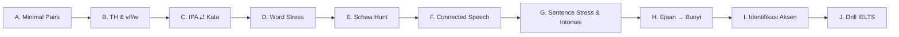

# 🎯 Bank Latihan Pronunciation + Kunci Jawaban

### Latihan bertingkat: bunyi → stress → connected speech → intonasi → identifikasi aksen

> Pasangan dari `silabus-british-rp.md`, `silabus-american.md`, `aksen-lengkap.md`.
> Default transkripsi = **RP** (/.../ fonemik). Kalau beda jauh di GenAm, ditandai.
> Tiap set ada **Kunci Jawaban** yang bisa dibuka (klik ▸). **Coba dulu, baru buka.**
>
> **Lanjutan per-aksen** (setelah SET A–C kuat): `latihan-rp.md` (drill khusus RP +
> writing British) dan `latihan-american.md` (drill khusus GenAm + writing American).

---

## 📌 Cara Latihan yang Bener

1. **Kerjakan dulu**, tulis jawaban di kertas/notes. Baru buka kunci. Jangan ngintip.
2. **Rekam suaramu** tiap latihan lisan → dengar ulang → bandingkan. Telinga kritis =
   guru terbaik. HP cukup.
3. **Salah itu data**, bukan gagal. Tandai yang salah, ulang 3 hari lagi (spaced repetition).
4. Urutan: SET A → J. Jangan lompat ke aksen (SET I) sebelum bunyinya kuat.

---

# SET A — Minimal Pairs (bedain bunyi) 🔴

## A.1 Vokal Panjang vs Pendek — /iː/ vs /ɪ/

Baca keras, rekam. Lalu: **pasangan ini bunyinya SAMA atau BEDA?** (semua harusnya beda —
tesnya: apakah *kamu* bisa bikin beda?)

1. sheep — ship
2. seat — sit
3. feel — fill
4. leave — live
5. reach — rich
6. heat — hit

**Tugas transkripsi:** tulis IPA untuk `sheep` dan `ship`.

▸ Kunci Jawaban A.1

- `sheep` /ʃiːp/ (panjang, lidah tinggi-depan tegang) vs `ship` /ʃɪp/ (pendek, lebih rileks/tengah).
- Semua 6 pasangan **beda**. Kunci: /iː/ = panjang & tegang; /ɪ/ = pendek & kendur (bukan sekadar "i pendek").
- Kesalahan Indo: bikin dua-duanya `/i/` → `sheep` = `ship`. Latih: tahan /iː/ 2× lebih lama + senyum lebar.

## A.2 /æ/ vs /e/  dan  /ʌ/ vs /æ/

**Grup 1 (/æ/ vs /e/):** 1. bad–bed  2. man–men  3. sat–set  4. had–head  5. bat–bet
**Grup 2 (/ʌ/ vs /æ/):** 6. cup–cap  7. cut–cat  8. bug–bag  9. run–ran  10. luck–lack

**Tugas:** transkripsi `bad`, `bed`, `cup`, `cap`.

▸ Kunci Jawaban A.2

- `bad` /bæd/ · `bed` /bed/ · `cup` /kʌp/ · `cap` /kæp/
- /æ/ = mulut lebar, rahang turun (kayak mau bilang "a" tapi datar). /e/ = lebih tertutup.
- /ʌ/ = vokal tengah pendek ("a" tertahan, kayak "uh"). /æ/ = depan lebar.
- Rantai maut: `cat /kæt/ → cut /kʌt/ → cot /kɒt/` — 3 vokal beda, sering ketuker.

## A.3 /ɒ/ vs /ɔː/ (cot–caught) 🟡

1. cot — caught  2. don — dawn  3. pot — port*  4. cod — cord*  5. stock — stalk

(*non-rhotic RP: `port`/pɔːt/, `cord`/kɔːd/ — beda dari /ɒ/ murni panjangnya + kualitas)

▸ Kunci Jawaban A.3

- `cot` /kɒt/ (pendek, bulat) vs `caught` /kɔːt/ (panjang, lebih tinggi & bulat).
- Di **GenAm** & Skotlandia & Kanada, pasangan ini **MERGED** (sama). Di RP & Aussie **beda**.
- Kalau kamu target GenAm: gak masalah nyamain. Target RP: wajib beda.

---

# SET B — TH & v/f/w (titik rawan Indo) 🔴🔴

## B.1 Triplet /θ/ vs /t/ vs /s/

Baca 3-3, pastikan beda:
1. thin — tin — sin
2. thick — tick — sick
3. think — — sink
4. three — tree — —
5. thought — taught — sort*

▸ Kunci Jawaban B.1

- `thin` /θɪn/ · `tin` /tɪn/ · `sin` /sɪn/ — lidah **antara gigi** buat /θ/, di belakang gigi buat /t/, mepet-halus buat /s/.
- Tes fisik: /θ/ ada aliran udara pelan lewat lidah-gigi (tanpa ledakan). /t/ ada ledakan. /s/ ada desis.
- Latih di cermin: lidah HARUS kelihatan nyembul dikit buat /θ ð/.

## B.2 /v/ vs /w/ vs /f/

1. vine — wine  2. vest — west  3. veal — wheel  4. van — fan  5. vine — fine  6. vet — wet

**Kalimat drill:** *"Very well, Wendy drove the white van."*

▸ Kunci Jawaban B.2

- `vine` /vaɪn/ (gigi-bibir + **getar**) · `wine` /waɪn/ (bibir bulat, tanpa gigi) · `fine` /faɪn/ (gigi-bibir, **tanpa** getar).
- /v/ = /f/ + suara (pegang tenggorokan: /v/ bergetar, /f/ tidak).
- Kesalahan Indo: `van`→"fan" (hilang getar) atau `vine`→"wine" (lupa gigi). Fokus: gigi atas nempel bibir bawah buat /v/ & /f/.

---

# SET C — IPA ⇄ Kata 🔴

## C.1 Baca IPA → tulis katanya (decode, RP)

1. /ˈkʌləz/
2. /ˈnɒlɪdʒ/
3. /ˈbɪznɪs/
4. /ˈvedʒtəbəl/
5. /ˈaɪlənd/
6. /ˈkwestʃən/
7. /ˈθɜːzdeɪ/
8. /ˈkʌmftəbəl/

▸ Kunci Jawaban C.1

1. **colours** 2. **knowledge** 3. **business** 4. **vegetable** 5. **island**
6. **question** 7. **Thursday** 8. **comfortable**

Perhatikan: ejaan boong! `business` cuma 2 suku bunyi /ˈbɪz-nɪs/, `vegetable` = /ˈvedʒ-tə-bəl/ (huruf 'e' kedua hilang), `comfortable` = /ˈkʌmf-tə-bəl/ (bukan "com-for-ta-ble").

## C.2 Tulis IPA (transcribe, RP)

1. thought  2. clothes  3. beautiful  4. answer  5. February  6. world

▸ Kunci Jawaban C.2

1. `thought` /θɔːt/ 2. `clothes` /kləʊðz/ (bukan "clo-thes"; /ð/ + /z/ nempel)
3. `beautiful` /ˈbjuːtɪfəl/ 4. `answer` /ˈɑːnsə/ (RP; `w` silent, GenAm /ˈænsər/)
5. `February` /ˈfebruəri/ atau /ˈfebjuəri/ 6. `world` /wɜːld/ (RP non-rhotic; GenAm /wɝːld/)

---

# SET D — Word Stress 🔴 (salah stress = orang bingung)

## D.1 Tandai suku bertekanan

Tulis ulang, KAPITAL-kan suku yang ditekan:
1. banana  2. important  3. photograph  4. photography  5. photographic
6. comfortable  7. development  8. necessary

▸ Kunci Jawaban D.1

1. ba-NA-na /bəˈnɑːnə/ 2. im-POR-tant /ɪmˈpɔːtənt/ 3. **PHO**-to-graph /ˈfəʊtəɡrɑːf/
4. pho-**TO**-gra-phy /fəˈtɒɡrəfi/ 5. pho-to-**GRA**-phic /ˌfəʊtəˈɡræfɪk/
6. **COM**-for-ta-ble /ˈkʌmftəbəl/ 7. de-**VEL**-op-ment /dɪˈveləpmənt/ 8. **NE**-ce-ssa-ry /ˈnesəsəri/

⚠️ Lihat 3–5: akar sama (`photo`) tapi stress **pindah** tergantung akhiran. Suku takbertekanan → schwa.

## D.2 Noun/Verb Stress Shift 🔴

Kata sama, arti beda tergantung stress. Tandai N (noun) vs V (verb):
1. record  2. present  3. object  4. produce  5. contract  6. export

▸ Kunci Jawaban D.2

Pola umum: **noun = stress depan**, **verb = stress belakang**.
1. **RE**-cord (n) /ˈrekɔːd/ · re-**CORD** (v) /rɪˈkɔːd/
2. **PRE**-sent (n) /ˈprezənt/ · pre-**SENT** (v) /prɪˈzent/
3. **OB**-ject (n) /ˈɒbdʒɪkt/ · ob-**JECT** (v) /əbˈdʒekt/
4. **PRO**-duce (n) /ˈprɒdjuːs/ · pro-**DUCE** (v) /prəˈdjuːs/
5. **CON**-tract (n) /ˈkɒntrækt/ · con-**TRACT** (v) /kənˈtrækt/
6. **EX**-port (n) /ˈekspɔːt/ · ex-**PORT** (v) /ɪkˈspɔːt/

Contoh kalimat: *"They **RE**cord a **RE**cord"* vs *"Please re**CORD** this."*

---

# SET E — Schwa Hunt /ə/ 🔴

## E.1 Berapa schwa & di mana?

Cari SEMUA bunyi /ə/ (vokal takbertekanan yang "melemah"):
1. banana  2. computer  3. about  4. teacher  5. again  6. camera  7. photographer

▸ Kunci Jawaban E.1

1. `banana` /bəˈnɑːnə/ — **2 schwa** (suku 1 & 3)
2. `computer` /kəmˈpjuːtə/ — **2 schwa** (com- & -er)
3. `about` /əˈbaʊt/ — **1** (a-)
4. `teacher` /ˈtiːtʃə/ — **1** (-er)
5. `again` /əˈɡen/ — **1** (a-)
6. `camera` /ˈkæmrə/ — **1** (-a akhir; 'e' tengah malah HILANG)
7. `photographer` /fəˈtɒɡrəfə/ — **3 schwa** (pho-, -gra-, -er)

Pola: hampir semua `-er`, `-a`, `-o` takbertekanan → /ə/. Schwa = bunyi paling sering di bahasa Inggris.

---

# SET F — Connected Speech 🟡 (bikin lancar/natural)

## F.1 Weak Forms — ucapkan kata fungsi ini bentuk lemahnya

Tulis IPA bentuk lemah: 1. and  2. to  3. of  4. for  5. can  6. was  7. them  8. at

▸ Kunci Jawaban F.1

1. and → /ən/ 2. to → /tə/ 3. of → /əv/ 4. for → /fə/ 5. can → /kən/ 6. was → /wəz/ 7. them → /ðəm/ 8. at → /ət/

Contoh: *"fish and chips"* /fɪʃ ən ˈtʃɪps/ (bukan "and" penuh), *"a cup of tea"* /ə ˈkʌp əv ˈtiː/.
⚠️ Bentuk kuat cuma dipakai kalau ditekankan/di ujung: *"Who's it **for**?"* /fɔː/.

## F.2 Linking, Elision, Assimilation

Ucapkan natural, lalu tulis apa yang berubah:
1. far away  2. law and order  3. next day  4. ten men  5. good boy  6. an apple  7. handbag

▸ Kunci Jawaban F.2

1. **Linking-r**: `far away` /fɑːr əˈweɪ/ — r "hidup lagi" karena diikuti vokal.
2. **Intrusive-r**: `law and order` /lɔːr ən ˈɔːdə/ — r "diselipin" walau gak ada di ejaan.
3. **Elision**: `next day` /neks deɪ/ — /t/ hilang di antara konsonan.
4. **Assimilation**: `ten men` /tem men/ — /n/ → /m/ ketularan /m/.
5. **Assimilation**: `good boy` /ɡʊb bɔɪ/ — /d/ → /b/.
6. **Catenation**: `an apple` /ə ˈnæpəl/ — konsonan nyambung ke vokal ("a-napple").
7. **Assimilation + elision**: `handbag` /ˈhæmbæɡ/ — /n/→/m/, /d/ hilang.

Ini yang bikin native "cepet & nyambung". Gak wajib produksi sempurna, tapi WAJIB kenali buat listening.

---

# SET G — Sentence Stress & Intonasi 🟡

## G.1 Tandai kata yang ditekan (content words)

Kata isi (noun, verb utama, adjective, adverb) ditekan; kata fungsi dilemahkan.
1. *I went to the shop to buy some bread.*
2. *She's going to call you tomorrow.*

▸ Kunci Jawaban G.1

1. *I **WENT** to the **SHOP** to **BUY** some **BREAD**.* (went, shop, buy, bread ditekan; I/to/the/some dilemahkan → /tə/, /ðə/, /səm/)
2. *She's **GOING** to **CALL** you to**MOR**row.* (going, call, tomorrow; she's/to/you lemah)

Ritme stress-timed: jarak antar-tekanan ~rata, kata di antaranya dipepet. Ini beda inti dari ritme Indo (syllable-timed).

## G.2 Intonasi: naik (↗) atau turun (↘)?

1. *Are you coming?* (yes/no question)
2. *What's your name?* (wh-question)
3. *Tea, coffee, or juice?* (pilihan)
4. *It's a beautiful day.* (pernyataan)

▸ Kunci Jawaban G.2

1. ↗ **naik** — yes/no question umumnya naik di ujung.
2. ↘ **turun** — wh-question umumnya turun (kedengeran yakin, bukan ragu).
3. ↗ Tea, ↗ coffee, ↘ or juice — pilihan: naik tiap opsi, **turun di terakhir**.
4. ↘ **turun** — pernyataan biasa turun di ujung.

⚠️ Kesalahan Indo: intonasi **datar/monoton**. Latihan: lebih-lebihkan naik-turunnya dulu.
Kalau semua kamu bikin naik (uptalk) → kedengeran ragu/nanya terus.

---

# SET H — Ejaan → Bunyi (jebakan) 🟡

## H.1 `-ough` (satu ejaan, 7 bunyi!)

Tulis IPA: 1. through  2. though  3. thought  4. tough  5. cough  6. bough  7. thorough

▸ Kunci Jawaban H.1

1. `through` /θruː/ 2. `though` /ðəʊ/ 3. `thought` /θɔːt/ 4. `tough` /tʌf/
5. `cough` /kɒf/ 6. `bough` /baʊ/ 7. `thorough` /ˈθʌrə/ (RP)

Pelajaran: **jangan pernah tebak bunyi dari ejaan Inggris.** Cek kamus + IPA.

## H.2 Huruf Bisu (silent letters)

Huruf mana yang **tidak** diucap? 1. knee  2. lamb  3. hour  4. island  5. castle  6. Wednesday  7. doubt  8. muscle

▸ Kunci Jawaban H.2

1. `knee` /niː/ — **k** bisu 2. `lamb` /læm/ — **b** 3. `hour` /aʊə/ — **h**
4. `island` /ˈaɪlənd/ — **s** 5. `castle` /ˈkɑːsəl/ — **t** 6. `Wednesday` /ˈwenzdeɪ/ — **d** (pertama)
7. `doubt` /daʊt/ — **b** 8. `muscle` /ˈmʌsəl/ — **c**

## H.3 Akhiran `-ed` (3 bunyi: /t/ /d/ /ɪd/)

Tulis bunyi akhirannya: 1. worked  2. played  3. wanted  4. watched  5. loved  6. needed  7. stopped  8. decided

▸ Kunci Jawaban H.3

Aturan: setelah bunyi **takbersuara** (kecuali /t/) → **/t/**; setelah **bersuara** (kecuali /d/) → **/d/**; setelah **/t/ atau /d/** → **/ɪd/**.

1. worked /t/ 2. played /d/ 3. wanted /ɪd/ 4. watched /t/ 5. loved /d/ 6. needed /ɪd/ 7. stopped /t/ 8. decided /ɪd/

⚠️ `-ɪd` HANYA setelah t/d. Kesalahan umum: bilang "worked" jadi "work-ed" /ˈwɜːkɪd/ (salah — harusnya /wɜːkt/).

---

# SET I — Identifikasi Aksen 🔴 (nyambung ke `aksen-lengkap.md`)

## I.1 Dari ciri, tebak aksennya

1. Rhotic + T-flap ("water"→"wader") + yod-drop ("new"→"noo") + `bath` = /bæθ/.
2. Non-rhotic + TH-fronting ("think"→"fink") + glottal-T ("butter"→"bu'er") + H-drop.
3. Rhotic + r ditap/getar + "face/goat" monophthong + cot=caught + bilang "aye".
4. Non-rhotic + "fish and chips" → "fush and chups" + "bed"→"bid".
5. Non-rhotic + "day"→"die" + intonasi naik di ujung pernyataan + "no worries".
6. Syllable-timed + T/D retrofleks + "v"≈"w" + "think"→"tink".
7. Non-rhotic + TRAP-BATH split + vokal jernih + "new"→"nyoo".
8. "pin" = "pen" + "ride"→"rahd" + "y'all".

▸ Kunci Jawaban I.1

1. **General American** (GenAm) 2. **Cockney** (London) 3. **Scottish**
4. **New Zealand** (Kiwi) 5. **Australian** 6. **Indian English**
7. **RP** (British Received Pronunciation) 8. **Southern US**

Balik ke `aksen-lengkap.md` Bagian 1 (sumbu pembeda) + Bagian 7 (pohon keputusan) kalau meleset.

## I.2 Tes cepat pembeda (isi jawaban)

1. Cara #1 bedain **Aussie vs Kiwi**?
2. Cara #1 bedain **Utara vs Selatan England**?
3. Cara #1 bedain **rhotic vs non-rhotic**?

▸ Kunci Jawaban I.2

1. Minta bilang **"fish and chips"**. Aussie: "fee-sh". Kiwi: "fu-sh" (KIT ke tengah).
2. Minta bilang **"butter" / "cut vs put"**. Selatan: /ʌ/ (cut≠put). Utara: /ʊ/ (cut=put).
3. Dengar **"car / water"**. Ada bunyi /r/ di ujung? → rhotic (Amerika-ish). Hilang? → non-rhotic (British-ish).

---

# SET J — Drill IELTS / Integrasi 🔴

## J.1 Tongue Twisters (target bunyi rawan)

Baca 3× makin cepat, rekam:
1. **TH:** *"The thirty-three thieves thought they thrilled the throne."*
2. **/v-w/:** *"We were very worried whether the weather would worsen."*
3. **Cluster:** *"She sells strong string; the sixth sheikh's sixth sheep's sick."*

▸ Kunci Jawaban J.1 (fokus & model)

1. Semua "th" = /θ/ (thirty /ˈθɜːti/, thieves /θiːvz/, thought /θɔːt/, thrilled /θrɪld/, throne /θrəʊn/). Lidah nyembul tiap kata.
2. Bedain /v/ (very /ˈveri/) vs /w/ (were, weather, would). Gigi buat v, bibir bulat buat w.
3. Cluster tanpa sisip vokal: `strong` /strɒŋ/ (bukan "se-trong"), `sixth` /sɪksθ/ (susah! /ks+θ/).

## J.2 Kalimat IELTS — stress + connected speech + intonasi

Baca natural (gabungkan semua skill), tandai stress & linking:
*"I've been living in Jakarta for about five years, and I really enjoy it."*

▸ Kunci Jawaban J.2 (model RP)

Stress (content words): *I've been **LIV**ing in Ja**KAR**ta for a**BOUT** **FIVE** **YEARS**, and I **REAL**ly en**JOY** it.*

Connected speech:
- `living in` → linking /ˈlɪvɪŋ ɪn/ (nyambung)
- `for about` → weak `for` /fə/ + linking /fər əˈbaʊt/
- `five years` → linking /faɪv jɪəz/
- `and I` → /ənd aɪ/ (and lemah /ən/, catenation ke I)
- `enjoy it` → /ɪnˈdʒɔɪ ɪt/ (linking)

Intonasi: turun ↘ di "years" (akhir klausa 1), turun ↘ di "it" (akhir). Naikin sedikit di "and" buat nyambung.

## J.3 Rutinitas Mingguan (checklist)

| Hari | Fokus | Latihan dari file ini |
|---|---|---|
| Sen | Vokal | SET A (minimal pairs), rekam |
| Sel | Konsonan | SET B (TH, v/f/w) di cermin |
| Rab | Stress | SET D + E (stress + schwa) |
| Kam | Connected speech | SET F, baca teks natural |
| Jum | Intonasi | SET G, lebih-lebihkan naik-turun |
| Sab | Integrasi | SET J.2, rekam jawaban IELTS Part 2 (2 menit) |
| Min | Listening | SET I + `aksen-lengkap.md`, tonton 1 aksen baru |

---

## 📎 Penutup

- Salah banyak di awal itu **normal**. Ukur progres per-minggu, bukan per-hari.
- Prioritas skor IELTS: **SET D (stress) > A/B (bunyi pembeda) > F (connected) > G (intonasi)**.
- Mau set latihan tambahan (khusus TH intensif, atau bank kalimat Part 2 IELTS, atau drill 1 aksen spesifik)? Tinggal minta.

*Kunci jawaban pakai RP. Untuk GenAm, perbedaan utama: rhotic (/r/ diucap), `bath`=/bæθ/, T-flap, yod-drop — lihat `silabus-american.md`.*
