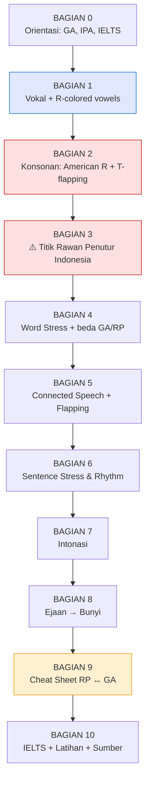
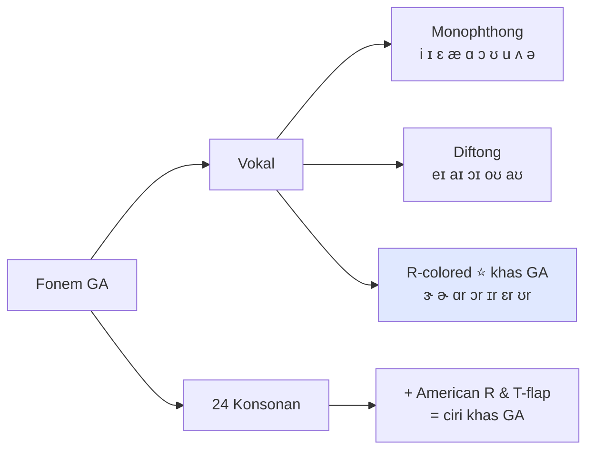
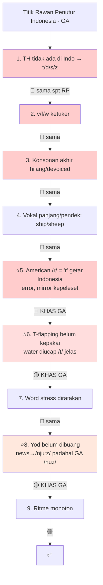

# 🇺🇸 General American (GA) — Silabus Pronunciation Lengkap
### Dari Pemula → Mahir (versi American, pendamping silabus British RP)

> Ini versi **American** dari silabus sebelumnya. Struktur sengaja gue bikin **paralel** sama yang British biar gampang dibandingin.
> Setiap bagian ada **contoh konkret + transkripsi IPA**. Baca berurutan.

---

## 📌 Baca Ini Dulu — RP vs American, Pilih Salah Satu

Sebelum mulai: **pilih SATU aksen dan konsisten.** Nyampur RP sama American (mis. "r" kadang diucap kadang enggak, `water` kadang /ˈwɔːtə/ kadang [ˈwɑɾɚ]) bikin kedengeran aneh & gak natural. Ini beda paling besar keduanya:

| Fitur | 🇬🇧 British RP | 🇺🇸 General American |
|-------|---------------|----------------------|
| Huruf "r" akhir/sblm konsonan | **HILANG** (`car` /kɑː/) | **DIUCAP** (`car` /kɑr/) — *rhotic* |
| `bath, dance, class` | /ɑː/ (`bath` /bɑːθ/) | /æ/ (`bath` /bæθ/) — no split |
| `hot, dog, God` | /ɒ/ (`hot` /hɒt/) | /ɑ/ (`hot` /hɑt/) |
| `go, home, phone` | /əʊ/ (`go` /gəʊ/) | /oʊ/ (`go` /goʊ/) |
| `water, better, city` (t di tengah) | /t/ jelas (`water` /ˈwɔːtə/) | **flap** [ɾ] → "wodder" [ˈwɑɾɚ] |
| `tune, news, student` | /tjuːn/ /njuːz/ (pakai "y") | /tun/ /nuz/ — *yod-dropping* |
| `bird, letter` | /ɜː/ /ə/ (`bird` /bɜːd/) | r-colored /ɝ/ /ɚ/ (`bird` /bɝd/) |

**Mana yang lebih gampang buat orang Indonesia?**
- 🇺🇸 **American lebih intuitif** dari sisi ejaan (semua "r" diucap, cocok sama insting kita yang baca-apa-adanya; gak perlu ngapalin kata mana yang /ɑː/). **TAPI** ada 2 tantangan baru yang lumayan: **American /r/** (bunyi retroflex/bunched yang beda banget dari "r" getar Indonesia) dan **T-flapping**.
- 🇬🇧 **RP** gak ada flapping/American-r, tapi lo harus latih **menghilangkan** "r" (lawan insting) + hapal TRAP–BATH split.
- **Buat IELTS: dua-duanya sama aja**, gak ngaruh ke skor. Pilih yang lo lebih suka dengerin (media/film yang lo tonton). Kebanyakan orang milih American karena exposure Hollywood/YouTube lebih gede.

---

## 🗺️ Peta Belajar (Roadmap)



---

## 🎯 Piramida Prioritas American

```
                    ╱╲
                   ╱  ╲        🟢 POLESAN
                  ╱ 5  ╲       Æ-raising, glottal-T, uptalk →
                 ╱______╲      polesan level native
                ╱        ╲
               ╱    4     ╲     🟡 INTONASI
              ╱____________╲    Variasi nada → gak monoton
             ╱              ╲
            ╱       3        ╲   🟡 T-FLAPPING + CONNECTED SPEECH
           ╱__________________╲  water→"wodder", linking → natural/lancar
          ╱                    ╲
         ╱          2           ╲  🔴 AMERICAN /r/ + WORD STRESS + SCHWA
        ╱________________________╲ Ciri paling khas GA + kunci intelligibility
       ╱                          ╲
      ╱             1              ╲  🔴 BUNYI PEMBEDA MAKNA
     ╱______________________________╲ /θ ð/, /v f w/, vokal, konsonan akhir
                                       (sama kayak RP — dasar wajib)
```

---

# BAGIAN 0 — Orientasi

## 0.1 Apa itu "General American"?

**General American (GA)** — disebut juga *Standard American*, *Network English*, atau *Broadcast English*. Ini aksen "netral" yang dipakai penyiar berita nasional AS (CNN, dll), setara posisinya sama RP di Inggris.

Fakta penting:
- GA **bukan** aksen satu daerah spesifik. Dia lebih ke aksen "tanpa penanda regional yang kentara" — sering diasosiasikan sama wilayah Midwest (Ohio, dsb).
- Amerika punya **banyak** aksen regional: Southern (Texas, Georgia), New York, Boston, California, AAVE (African American Vernacular English), Minnesota/Upper Midwest, dll. GA adalah yang "paling nasional".
- Yang lo denger di kebanyakan film Hollywood & YouTuber Amerika = kurang lebih GA (atau California English yang mirip).

## 0.2 Realita IELTS (sama kayak versi British)

**IELTS gak nuntut aksen American maupun British.** Band 9 bisa diraih dengan aksen apapun asal **jelas & mudah dimengerti**. Yang dinilai: intelligibility, word/sentence stress, connected speech, variasi intonasi — **bukan** "kedengeran kayak orang Amerika".

Jadi kejar GA itu boleh & skill-nya transfer ke IELTS, tapi **target = kejelasan**, bukan kesempurnaan aksen. (Detail di Bagian 10.)

## 0.3 IPA — Alat Wajib 🔴

Sama kayak sebelumnya: lo **gak bisa** serius tanpa baca IPA. Bedanya, notasi GA sedikit beda dari RP:
- GA sering **gak pakai tanda panjang** `ː` (mis. GA `see` /si/, RP /siː/). Tapi tense/lax tetap ada.
- GA punya simbol khusus **r-colored**: `/ɝ/` (bird) dan `/ɚ/` (letter) — ini yang gak ada di RP.
- Kamus American (Merriam-Webster pakai notasi sendiri; tapi **Cambridge Dictionary** kasih dua-duanya: "UK" & "US" dengan IPA + audio — pakai ini!).

## 0.4 Peta Sistem Bunyi GA



---

# BAGIAN 1 — VOKAL (Vowels) 🔴

## 1.1 Peta Vokal GA (Vowel Quadrilateral)

```
              DEPAN          TENGAH           BELAKANG
          ┌───────────────────────────────────────────────┐
 SEMPIT   │  i                                      u      │
          │    ɪ                                  ʊ         │
          │                                                │
          │      ɛ           ə  ɝ/ɚ                  ɔ      │
 SEDANG   │                                                │
          │        æ                                       │
 LEBAR    │                    ʌ                    ɑ      │
          └───────────────────────────────────────────────┘

anchor:  i=s(ee)  ɪ=s(i)t  ɛ=b(e)d  æ=c(a)t
         ə=(a)bout  ɝ=b(ir)d  ʌ=c(u)p
         u=b(oo)t  ʊ=f(oo)t  ɔ=th(ou)ght  ɑ=h(o)t / f(a)ther
```

> Perhatiin: GA **gak punya /ɒ/** (LOT vowel RP). Di GA, `hot` pakai **/ɑ/** — vokal yang sama kayak `father` & `car` (tanpa r). Ini "father–bother merger": di GA `father` & `bother` berima.

## 1.2 Monophthongs GA

| IPA | Nama | Contoh | IPA kata | Beda dari RP? |
|-----|------|--------|----------|---------------|
| /i/ | FLEECE | see, me, tree | /si/ | Sama (RP /iː/) |
| /ɪ/ | KIT | sit, ship, big | /sɪt/ | Sama |
| /ɛ/ | DRESS | bed, met, pet | /bɛd/ | Sama (RP /e/) |
| /æ/ | TRAP | cat, bad, **bath, dance** | /kæt/, /bæθ/ | ⭐ Termasuk kata BATH! (RP /ɑː/) |
| /ɑ/ | LOT/PALM | hot, father, not | /hɑt/ | ⭐ RP pakai /ɒ/ utk hot, /ɑː/ utk father |
| /ɔ/ | THOUGHT | thought, dog, caught | /θɔt/, /dɔɡ/ | ⚠️ Banyak orang AS **gabung** ke /ɑ/ (lihat bawah) |
| /ʊ/ | FOOT | foot, pull, would | /fʊt/ | Sama |
| /u/ | GOOSE | boot, blue, two | /but/ | Sama (RP /uː/) |
| /ʌ/ | STRUT | cup, love, mud | /kʌp/ | Sama |
| /ə/ | schwa | about, sofa | /əˈbaʊt/ | Sama (tapi lihat r-colored /ɚ/) |

> ⚠️ **Cot–Caught merger:** di banyak wilayah AS (Barat, banyak Midwest), /ɔ/ dan /ɑ/ **digabung** → `cot` = `caught` = /kɑt/, `Don` = `dawn`. Buku teks GA masih bedain, tapi kalau lo mau paling "netral & modern", boleh gabung dua-duanya jadi /ɑ/. Konsisten aja.

## 1.3 Diftong GA

| IPA | Contoh | IPA kata | Beda dari RP? |
|-----|--------|----------|---------------|
| /eɪ/ | face, make, cake | /feɪs/ | Sama |
| /aɪ/ | price, my, rice | /praɪs/ | Sama |
| /ɔɪ/ | choice, boy, noise | /tʃɔɪs/ | Sama |
| /oʊ/ | go, show, home | /ɡoʊ/ | ⭐ RP pakai /əʊ/. GA mulai lebih bulat/belakang. |
| /aʊ/ | mouth, now, south | /maʊθ/ | Sama |

> **Titik penting buat orang Indo:** GOAT vowel /oʊ/. Jangan bikin jadi "o" polos Indonesia. Ada gerakan o→u: `go` /ɡoʊ/, `home` /hoʊm/, `don't` /doʊnt/, `phone` /foʊn/.

## 1.4 ⭐ R-COLORED VOWELS (Rhotacized) — Jantung Aksen American 🔴🔴

**Ini bagian yang PALING beda dari RP dan paling bikin kedengeran American.** Di GA, vokal + "r" **melebur** jadi satu bunyi ber-r. Lidah udah ambil posisi "r" **selama** vokalnya, bukan setelahnya.

| IPA | Contoh | IPA kata | Padanan RP (non-rhotic) |
|-----|--------|----------|-------------------------|
| **/ɝ/** | bird, work, hurt, learn | /bɝd/, /wɝk/ | /ɜː/ (`bird` /bɜːd/) |
| **/ɚ/** | letter, teacher, doctor, water | /ˈlɛɾɚ/, /ˈtitʃɚ/ | /ə/ (`letter` /ˈletə/) |
| **/ɑr/** | car, start, park, hard | /kɑr/, /stɑrt/ | /ɑː/ (`car` /kɑː/) |
| **/ɔr/** | more, north, for, door | /mɔr/, /nɔrθ/ | /ɔː/ (`more` /mɔː/) |
| **/ɪr/** | near, here, ear, beer | /nɪr/, /hɪr/ | /ɪə/ (`near` /nɪə/) |
| **/ɛr/** | square, hair, care, there | /skwɛr/, /hɛr/ | /eə/ (`square` /skweə/) |
| **/ʊr/** | cure, pure, tour | /kjʊr/, /pjʊr/ | /ʊə/ (`cure` /kjʊə/) |

**Bedanya /ɝ/ vs /ɚ/:** bunyi **sama**, cuma beda tekanan.
- `/ɝ/` = versi **ditekan** (stressed): b**ir**d, w**or**d, n**ur**se
- `/ɚ/` = versi **tak ditekan** (unstressed): teach**er**, doct**or**, und**er**

Kata dengan dua-duanya: `murder` /ˈmɝdɚ/ — suku 1 ditekan (/ɝ/), suku 2 enggak (/ɚ/). Latih: `perfect` /ˈpɝfɪkt/, `further` /ˈfɝðɚ/, `surprise` /sɚˈpraɪz/.

> **Cara latih:** ini soal **timing lidah**. Coba bilang "uh" lalu langsung "r" tanpa jeda → gabung jadi /ɝ/. Ujung lidah naik/nekuk ke belakang (retroflex) ATAU badan lidah nggumpal (bunched) — dua-duanya boleh, bunyinya sama. Lidah **gak nyentuh** langit-langit.

## 1.5 SCHWA & Reduksi 🔴

Sama pentingnya kayak di RP: suku tak bertekanan → schwa /ə/ (atau /ɚ/ kalau ada "r"). Ini kunci ritme.
- `banana` → /bəˈnænə/ (di GA vokal tengahnya /æ/, beda dari RP /ɑː/)
- `computer` → /kəmˈpjuɾɚ/ (perhatiin: schwa + flap-t + r-colored di akhir!)
- `about` → /əˈbaʊt/

Kabar baik lagi: bahasa Indonesia punya schwa ("e" di **emas**), jadi lo udah punya modalnya.

## 1.6 (Catatan) GA TIDAK Punya TRAP–BATH Split

Di RP lo harus hapal `bath, dance, class` = /ɑː/. **Di GA gak perlu** — semua pakai /æ/:
- `bath` /bæθ/, `dance` /dæns/, `class` /klæs/, `can't` /kænt/, `example` /ɪɡˈzæmpəl/, `half` /hæf/

Ini salah satu hal yang bikin GA **lebih simpel** buat dipelajari. Satu aturan kurang buat dihapal.

---

# BAGIAN 2 — KONSONAN (Consonants) 🔴

24 konsonan sama kayak RP. Yang **beda dari RP** dan bikin GA: **American /r/**, **T-flapping**, **glottal-T**, dan **yod-dropping**. Fokus ke sini.

## 2.1 Tabel Konsonan (place × manner)

| Cara \ Tempat | Bibir | Bibir-Gigi | Gigi | Gusi | Langit-2 | Belakang | Tenggorok |
|---------------|-------|-----------|------|------|----------|----------|-----------|
| **Plosif** | p b | | | t d | | k g | |
| **Frikatif** | | f v | θ ð | s z | ʃ ʒ | | h |
| **Afrikat** | | | | | tʃ dʒ | | |
| **Nasal** | m | | | n | | ŋ | |
| **Approximant** | w | | | l, **r** | j | | |

Bunyi /θ ð/, /v f w/, /s z/, dst **sama persis** aturannya kayak di silabus RP (TH lidah antara gigi, /v/ bibir-gigi getar, dst). Gue gak ulang di sini — **lihat Bagian 2.2–2.3 silabus British**, berlaku 100% buat GA juga.

## 2.2 ⭐🔴🔴 The American /r/ (Bunyi Paling Khas GA)

Kalau RP ciri utamanya *menghilangkan* r, GA justru **mengucapkan semua r** dengan bunyi yang sangat khas. Ini **tersulit** buat orang Indonesia karena "r" kita digetarkan/ditap, sedangkan American /r/ **tidak bergetar sama sekali**.

**Dua cara bikin (pilih salah satu — bunyinya identik):**
```
1) RETROFLEX R: ujung lidah nekuk ke BELAKANG (ke arah langit),
   tapi TIDAK menyentuh apa-apa.

2) BUNCHED R: ujung lidah turun, BADAN lidah nggumpal naik
   di tengah mulut. Juga tidak menyentuh.

   Dua-duanya: bibir agak MEMBULAT & sedikit maju.
   Lidah MENGAMBANG — nol kontak, nol getaran.

        langit-langit
        ═══════════════
             ╱ (lidah nekuk/nggumpal, mengambang)
        ═══════════════
   ❌ BUKAN "rrr" bergetar Indonesia
   ❌ BUKAN "r" tap/ketuk
```

Latihan bertahap:
- Awal kata: **r**ed /rɛd/, **r**un /rʌn/, **r**ight /raɪt/
- Sesudah konsonan (cluster): d**r**ive /draɪv/, t**r**ee /tri/, g**r**een /ɡrin/
- **Akhir/r-colored** (ini yang wajib, beda dari RP): ca**r** /kɑr/, mo**r**e /mɔr/, wo**r**k /wɝk/, teach**er** /ˈtitʃɚ/, ha**r**d /hɑrd/

> Tes: bilang `error` /ˈɛrɚ/, `mirror` /ˈmɪrɚ/, `rural` /ˈrʊrəl/ — kalau lidahmu bergetar/kepeleset, berarti masih "r" Indonesia. Target: mulus tanpa getar.

## 2.3 ⭐🔴 T-Flapping (Rahasia Kedengeran "Beneran" American)

Di GA, **/t/ (dan /d/) di antara dua vokal jadi FLAP [ɾ]** — bunyi ketukan lidah cepat yang kedengeran kayak "d" cepat. Inilah kenapa `water` kedengeran "**wodder**".

**Aturan flap:** /t/ atau /d/ → [ɾ] kalau:
1. Ada di **antara dua vokal** (atau setelah /r/ + vokal), DAN
2. Vokal **sesudahnya tak bertekanan**.

| Kata | Ejaan bunyi | IPA GA |
|------|-------------|--------|
| water | "wodder" | /ˈwɑɾɚ/ |
| better | "bedder" | /ˈbɛɾɚ/ |
| city | "ciddy" | /ˈsɪɾi/ |
| little | "liddle" | /ˈlɪɾl̩/ |
| party | "pardy" | /ˈpɑrɾi/ |
| matter | "madder" | /ˈmæɾɚ/ |
| data | "dada" | /ˈdæɾə/ atau /ˈdeɪɾə/ |

Efeknya: **`latter` = `ladder`** dan **`atom` = `Adam`** (jadi homophone!) di GA.

**Flap juga lompat antar kata:**
- `get it` → [ˈɡɛɾ ɪt] "geddit"
- `a lot of` → [ə ˈlɑɾ əv] "a lodda"
- `shut up` → [ˈʃʌɾ ʌp] "shuddup"
- `not at all` → [ˈnɑɾ əɾ ˈɔl]

**JANGAN flap kalau /t/ di awal suku bertekanan:** `attend` /əˈtɛnd/ (t jelas beraspirasi), `return` /rɪˈtɝn/, `hotel` /hoʊˈtɛl`, `Atlantic` (t sebelum stress). Di sini /t/ tetap /t/.

## 2.4 🟡 Glottal T (sebelum "n" suku kata)

/t/ sebelum **syllabic n** jadi glottal stop [ʔ] (hentakan tenggorokan). Ini khas GA & beda dari flap:
- `button` → [ˈbʌʔn̩], `mountain` → [ˈmaʊnʔn̩], `important` → [ɪmˈpɔrʔn̩t], `kitten` → [ˈkɪʔn̩], `written` → [ˈrɪʔn̩]

Coba: tahan aliran udara sebentar di tenggorokan buat "tt", lalu lepas ke "n" (tanpa vokal): "bu-'n".

## 2.5 🟡 Yod-Dropping (`tune` = "toon")

GA **membuang /j/** ("y") setelah konsonan gusi /t d n s l/. RP mempertahankannya.

| Kata | 🇬🇧 RP | 🇺🇸 GA |
|------|--------|--------|
| tune | /tjuːn/ | /tun/ ("toon") |
| news | /njuːz/ | /nuz/ ("nooz") |
| duke | /djuːk/ | /duk/ ("dook") |
| student | /ˈstjuːdənt/ | /ˈstudənt/ |
| new | /njuː/ | /nu/ ("noo") |
| Tuesday | /ˈtjuːzdeɪ/ | /ˈtuzdeɪ/ ("toozday") |
| suit | /sjuːt/ | /sut/ |

> Tapi /j/ **tetap ada** setelah konsonan lain: `cute` /kjut/, `few` /fju/, `music` /ˈmjuzɪk/, `pure` /pjʊr/. Yang dibuang cuma setelah t/d/n/s/l.

## 2.6 🟡 Dark L Everywhere

GA cenderung pakai **dark L** [ɫ] di lebih banyak posisi dibanding RP — bahkan L di awal pun agak "gelap". Coba `feel`, `milk`, `cold`, `people` dengan lidah belakang naik → bunyi lebih berat. (Polesan, bukan urgent.)

## 2.7 🔴 Aspirasi & Konsonan Akhir (sama kayak RP)

- **/p t k/ awal suku bertekanan** tetap beraspirasi [pʰ tʰ kʰ]: `pin` [pʰɪn], `top` [tʰɑp], `cat` [kʰæt].
- **Konsonan akhir wajib jelas** + vokal sebelum konsonan bersuara lebih panjang: `bag` /bæɡ/ (bukan "bak"), `bad` (vokal panjang) vs `bat` (pendek). Aturan ini **identik** dengan silabus RP Bagian 2.7 — masalah besar penutur Indo, jangan diabaikan.

---

# BAGIAN 3 — ⚠️ TITIK RAWAN PENUTUR INDONESIA (versi GA)

Kebanyakan jebakan **sama** kayak versi RP (TH, v/f/w, konsonan akhir, cluster, word stress). Yang **beda/baru khusus GA** gue tandain ⭐.



### Ringkasan solusi kilat (yang KHAS GA)

| # | Masalah GA | Contoh error | Fix |
|---|-----------|-------------|-----|
| ⭐5 | American /r/ digetarkan | `car` jadi "kar" bergetar | Lidah mengambang, nol getar (2.2) |
| ⭐6 | /t/ tengah tetap jelas | `water` /ˈwɔtər/ | Flap → "wodder" (2.3) |
| ⭐8 | /j/ belum dibuang | `student` /ˈstjudənt/ | Buang yod → /ˈstudənt/ (2.5) |
| 1–4,7,9 | (sama seperti RP) | — | Lihat silabus British Bagian 3 |


---

# BAGIAN 4 — WORD STRESS 🔴

Aturan word stress **sama** antara GA dan RP (noun 2-suku → depan, verb 2-suku → belakang, -tion → sebelum akhiran, dst). **Lihat silabus British Bagian 4** buat aturan lengkap + decision tree — semua berlaku di GA.

Yang **beda: beberapa kata punya stress/bunyi berbeda** antara GA & RP. Ini yang perlu lo hapal kalau mau konsisten American:

| Kata | 🇬🇧 RP | 🇺🇸 GA |
|------|--------|--------|
| address (n) | əˈdres (stress 2) | ˈædrɛs (stress 1) |
| advertisement | ədˈvɜːtɪsmənt (stress 2) | ˌædvɚˈtaɪzmənt (stress 3) |
| garage | ˈɡærɑːʒ / ˈɡærɪdʒ (stress 1) | ɡəˈrɑʒ (stress 2) |
| ballet | ˈbæleɪ (stress 1) | bæˈleɪ (stress 2) |
| weekend | ˌwiːkˈend | ˈwiːkɛnd (stress 1) |
| schedule | ˈʃedjuːl ("shed-") | ˈskɛdʒul ("sked-") |
| vitamin | ˈvɪtəmɪn ("vit-") | ˈvaɪtəmɪn ("vy-") |
| tomato | təˈmɑːtəʊ ("-mah-") | təˈmeɪtoʊ ("-may-") |
| either | ˈaɪðə ("eye-") | ˈiðɚ ("ee-") |
| leisure | ˈleʒə ("leh-") | ˈliʒɚ ("lee-") |
| mobile | ˈməʊbaɪl | ˈmoʊbəl |
| missile | ˈmɪsaɪl | ˈmɪsəl |
| privacy | ˈprɪvəsi ("priv-") | ˈpraɪvəsi ("pry-") |
| herb | hɜːb (h diucap) | ɝb (h SENYAP → "erb") |

---

# BAGIAN 5 — CONNECTED SPEECH 🟡

Prinsip connected speech (linking, elision, assimilation, weak forms, contractions) **sama** kayak silabus RP Bagian 5. Yang **beda khusus GA**:

## 5.1 Linking lewat Flap (khas GA)
Karena flapping lompat antar kata, linking GA sering lewat [ɾ]:
- `get out` → [ɡɛ ɾ aʊt] "geddout"
- `put it on` → [pʊ ɾ ɪ ɾ ɑn] "puddidon"
- `what about it` → [wʌ ɾ ə baʊ ɾ ɪt]

## 5.2 Linking-R Otomatis, TAPI ⚠️ TANPA Intrusive-R
Karena GA rhotic, "r" udah selalu diucap → linking-r otomatis (`far away` /fɑr əˈweɪ/ — r-nya emang selalu ada).

> **Beda penting dari RP:** GA **tidak** pakai *intrusive-R*. Di RP `the idea of it` disisipi r → /aɪˈdɪər əv/. Di GA **tidak**: `idea of` /aɪˈdiə əv/ tanpa r sisipan. Jangan bawa kebiasaan intrusive-r RP ke GA.

## 5.3 Weak Forms & Contractions (sama)
`to` → /tə/, `and` → /ən/ ("rock 'n' roll"), `of` → /əv/, `you` → /jə/, `going to` → "gonna" /ˈɡʌnə/, `want to` → "wanna" /ˈwɑnə/, `got to` → "gotta" /ˈɡɑɾə/ (dengan flap!). Contractions identik: `I'm, don't, she's, would've`.

---

# BAGIAN 6 — SENTENCE STRESS & RHYTHM 🔴

**Identik** dengan silabus RP Bagian 6: bahasa Inggris (baik GA maupun RP) itu **stress-timed**. Content words ditekan, function words dilemahkan → schwa. Jarak antar-stress kira-kira sama, suku tak bertekanan dipadatkan.

Contoh (HURUF BESAR = ditekan):
> I'm **GO**nna **GET** some **COFF**ee this **AF**ternoon.
> /aɪm ˈɡʌnə ˈɡɛɾ səm ˈkɔfi ðɪs ˈæftɚˌnun/

Perhatiin `gonna`, `get` (flap-linked), `some` → schwa. Ritmenya jatuh di GO–GET–COFF–AF.

---

# BAGIAN 7 — INTONASI 🟡

Pola intonasi dasar (lima tone: falling, rising, fall-rise, rise-fall, level) **sebagian besar sama** antara GA & RP — **lihat silabus RP Bagian 7** buat detail + diagram kontur.

Nuansa khas American yang perlu dicatat:
- **Range nada GA sedikit lebih sempit/datar** dibanding RP stereotipikal yang naik-turunnya lebih dramatis. Jangan berlebihan naik-turun ala "posh British".
- **Uptalk / High Rising Terminal (HRT)** 🟢 — sebagian penutur muda AS naikin nada di **akhir pernyataan** (bukan cuma pertanyaan), bikin pernyataan kedengeran kayak nanya. Ini fitur informal/generasi muda, **hindari di IELTS** (bisa kedengeran gak yakin).
- Aturan praktis buat IELTS **sama**: pernyataan & WH-question → falling ↘; Yes/No question → rising ↗; list → item naik ↗, terakhir turun ↘.


---

# BAGIAN 8 — POLA EJAAN → BUNYI (GA) 🟢

Sebagian besar pola ejaan sama, tapi ada beberapa yang **beda hasil bunyinya** di GA vs RP:

| Pola ejaan | 🇬🇧 RP | 🇺🇸 GA | Contoh |
|-----------|--------|--------|--------|
| a + [s/th/f/n+kons] | /ɑː/ | **/æ/** | bath, dance, class, can't |
| o + kons (LOT) | /ɒ/ | **/ɑ/** | hot, dog, box, stop |
| o + kons + e | /əʊ/ | **/oʊ/** | home, note, hope |
| oa | /əʊ/ | **/oʊ/** | boat, road, coat |
| ar | /ɑː/ | **/ɑr/** | car, park, hard |
| or / ore | /ɔː/ | **/ɔr/** | more, born, store |
| er/ir/ur (bertekanan) | /ɜː/ | **/ɝ/** | her, bird, turn |
| -er (akhir, lemah) | /ə/ | **/ɚ/** | teacher, water, better |
| new/tune/duke (yod) | /njuː/ dst | **/nu/** dst | new, tune, student |

Sisanya (huruf i, e, u, e+kons+e, dst) — pola sama, **lihat silabus RP Bagian 8**. Heteronyms (`read`/`read`, `live`/`live`, dll) juga identik.

---

# BAGIAN 9 — 🔑 CHEAT SHEET RP ↔ GA (Konversi Cepat)

Ini bagian paling praktis kalau lo udah kenal RP dan mau "convert" ke GA (atau sebaliknya). **10 aturan konversi:**

```
1. TAMBAHKAN semua "r"          car:  kɑː  → kɑr        (rhotic)
2. LOT: ɒ → ɑ                   hot:  hɒt  → hɑt
3. BATH: ɑː → æ                 bath: bɑːθ → bæθ
4. GOAT: əʊ → oʊ                go:   ɡəʊ  → ɡoʊ
5. NURSE: ɜː → ɝ                bird: bɜːd → bɝd
6. letter: ə → ɚ                letter: -tə → -ɾɚ
7. FLAP t/d di antara vokal     water: -tə → -ɾɚ         (wodder)
8. BUANG yod stlh t/d/n/s/l     news: njuːz → nuz
9. NEAR/SQUARE/CURE r-colored   near: nɪə → nɪr
10. HAPUS intrusive-r           idea of: -ər əv → -ə əv
```

### Contoh kalimat, dua versi:

> **"I'd rather not bother the doctor about water."**
>
> 🇬🇧 RP: /aɪd ˈrɑːðə nɒt ˈbɒðə ðə ˈdɒktə(r) əˈbaʊt ˈwɔːtə/
> 🇺🇸 GA: /aɪd ˈræðɚ nɑt ˈbɑðɚ ðə ˈdɑktɚ əˈbaʊt ˈwɑɾɚ/

Perhatiin: `rather` (ɑː→æ), `not/bother/doctor` (ɒ→ɑ), semua `-er` (ə→ɚ), `water` (flap + r-colored).

### Tabel kata pembanding cepat

| Kata | 🇬🇧 RP | 🇺🇸 GA |
|------|--------|--------|
| water | ˈwɔːtə | ˈwɑɾɚ |
| better | ˈbetə | ˈbɛɾɚ |
| car | kɑː | kɑr |
| bird | bɜːd | bɝd |
| dance | dɑːns | dæns |
| hot | hɒt | hɑt |
| go | ɡəʊ | ɡoʊ |
| new | njuː | nu |
| teacher | ˈtiːtʃə | ˈtitʃɚ |
| thirty | ˈθɜːti | ˈθɝɾi |

---

# BAGIAN 10 — STRATEGI IELTS + LATIHAN + SUMBER

## 10.1 IELTS (sama untuk GA & RP)
- 4 kriteria @25%: Fluency, Lexical, Grammar, **Pronunciation**.
- Pronunciation dinilai: intelligibility, word/sentence stress, connected speech, variasi intonasi. **Bukan** aksen tertentu.
- Prioritas Band 6→7+: kejelasan konsonan akhir & vokal → word stress → sentence stress → connected speech → intonasi. **Aksen GA murni = paling akhir.**
- Kata sering salah (cek bunyi GA): `comfortable` /ˈkʌmftɚbəl/, `vegetable` /ˈvɛdʒtəbəl/, `Wednesday` /ˈwɛnzdeɪ/, `February` /ˈfɛbjuˌɛri/, `interesting` /ˈɪntrəstɪŋ/, `photography` /fəˈtɑɡrəfi/.

## 10.2 Rutinitas Mingguan (~30 mnt/hari)

| Hari | Fokus GA | Aktivitas |
|------|----------|-----------|
| Sen | R-colored vowels | Drill bird/work/letter/car, rekam |
| Sel | American /r/ | error/mirror/rural sampai nol getar |
| Rab | T-flapping | 20 kata (water, city…) + antar-kata |
| Kam | Word stress | Tandai stress 20 kata, ucap |
| Jum | Connected speech | Shadowing klip 2 mnt (film/YouTuber AS) |
| Sab | Integrasi | Rekam jawaban IELTS Part 2 (2 mnt) |
| Min | Review | Bandingkan rekaman vs native |

## 10.3 Teknik Paling Efektif
1. **Shadowing** 🔴 — ikuti audio native **bersamaan**, tiru melodi + flap + r-colored. Teknik #1.
2. **Minimal pairs** — `ship/sheep`, `bat/bad`, `latter/ladder`.
3. **Rekam & bandingkan** — telinga = guru terbaik.
4. **Backchaining** buat r-colored: `-ter` → `wa-ter` → `water` [ˈwɑɾɚ].

## 10.4 Sumber GA
- **Cambridge Dictionary** — tiap kata ada audio **US** + IPA. Default tool lo.
- **Interactive American English phonemic chart** (cari "American English IPA chart interactive").
- **YouTube:** "Rachel's English" (spesialis GA, penjelasan flapping & American-r paling bagus), "Accent's Way / Hadar Shemesh", "Sound American", "mmmEnglish" (mix).
- **Shadowing:** film/serial AS, podcast (NPR), YouTuber Amerika yang aksennya netral.

## 10.5 Checklist "Aku Udah Bisa GA" ✅
- [ ] Baca IPA + simbol r-colored /ɝ ɚ/
- [ ] American /r/ tanpa getar (`error`, `rural`)
- [ ] Semua "r" akhir diucap (`car`, `more`, `work`)
- [ ] T-flapping otomatis (`water`→"wodder", `get it`→"geddit")
- [ ] Yod-dropping (`news`→"nooz", `student`→"stoodent")
- [ ] LOT /ɑ/ & GOAT /oʊ/ (`hot`, `go`)
- [ ] BATH pakai /æ/ (`dance`, `class`)
- [ ] Konsonan akhir jelas + TH konsisten (dasar wajib)
- [ ] Word stress benar, weak forms kepakai
- [ ] Intonasi bervariasi, gak uptalk berlebihan

---

## 📎 LAMPIRAN A — Fonem GA

**MONOPHTHONG:** i (see) · ɪ (sit) · ɛ (bed) · æ (cat/bath) · ɑ (hot/father) · ɔ (thought) · ʊ (foot) · u (boot) · ʌ (cup) · ə (about)
**R-COLORED ⭐:** ɝ (bird) · ɚ (letter) · ɑr (car) · ɔr (more) · ɪr (near) · ɛr (square) · ʊr (cure)
**DIFTONG:** eɪ (face) · aɪ (price) · ɔɪ (boy) · oʊ (go) · aʊ (now)
**KONSONAN:** p b t d k g · f v θ ð s z ʃ ʒ h · tʃ dʒ · m n ŋ · l r w j

## 📎 LAMPIRAN B — Minimal Pairs Khas GA

| Kontras | Pasangan |
|---------|----------|
| flap: t vs d hilang | latter/ladder, writer/rider, atom/Adam |
| /ɝ/ vs /ɑr/ | bird/bard, hurt/heart, further/father(-ish) |
| /ɑ/ vs /ʌ/ | cop/cup, lock/luck, cot/cut |
| /ɑ/ vs /ɔ/ (kalau tak merger) | cot/caught, Don/dawn, stock/stalk |
| yod: GA vs RP | too/tune, do/dew, noon/new |
| /æ/ vs /ɛ/ | bad/bed, man/men, sat/set |

*(Pasangan dasar /θ-t/, /v-f/, /ɪ-iː/, dll sama kayak Lampiran B silabus British.)*

---

*Dokumen ini adalah versi American dari silabus British RP-mu, disusun paralel. Kalau butuh salah satu diperdalam (mis. drill khusus American /r/, atau daftar 50 kata T-flapping buat latihan), tinggal minta.*