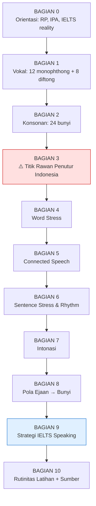
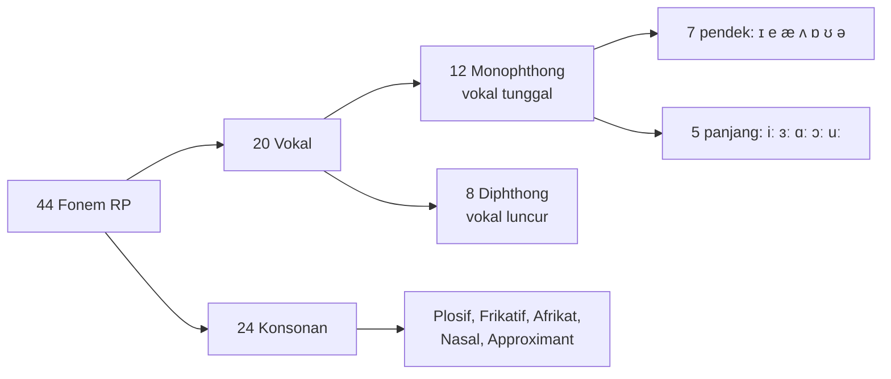
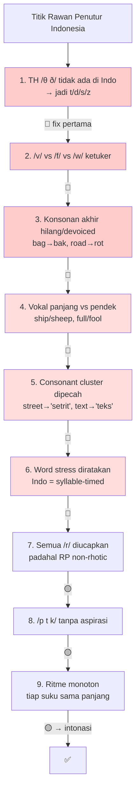
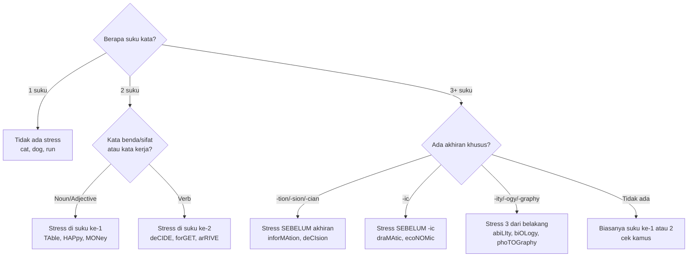
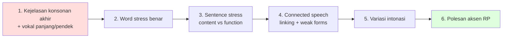

# 🇬🇧 British English RP — Silabus Pronunciation Lengkap
### Dari Pemula → Mahir (dengan fokus persiapan IELTS Speaking)

> Disusun ulang dari catatan acak kamu, dirapikan + dikoreksi oleh "native RP speaker".
> Setiap bagian ada **contoh konkret + transkripsi IPA**. Baca berurutan, jangan lompat.

---

## 📌 Cara Pakai Silabus Ini

1. **Jangan hafal semua sekaligus.** Ini disusun berlapis: kuasai lapisan bawah dulu (bunyi), baru naik (stress → connected speech → intonasi).
2. Semua contoh pakai **IPA** (International Phonetic Alphabet). Kalau belum bisa baca IPA, mulai dari **Bagian 0.3**.
3. Tanda `/.../ ` = transkripsi fonemik. Tanda `[...]` = transkripsi fonetik (lebih detail, gimana bener-bener diucap).
4. Ikon prioritas di tiap section:
   - 🔴 **WAJIB** — kalau salah, orang susah ngerti kamu / rugi nilai IELTS
   - 🟡 **PENTING** — bikin aksen kedengeran natural
   - 🟢 **POLESAN** — nice-to-have, level "native"

---

## 🗺️ Peta Belajar (Roadmap)



---

## 🎯 Prioritas: Apa yang Harus Dikuasai Duluan?

Kamu bilang gak tau mana yang sepele mana yang urgent. Ini jawabannya — **piramida prioritas**. Kuasai dari bawah ke atas.

```
                    ╱╲
                   ╱  ╲        🟢 POLESAN
                  ╱ 5  ╲       Diftong halus, dark-L, glottal-T,
                 ╱______╲      intrusive-R → bikin kedengeran "native"
                ╱        ╲
               ╱    4     ╲     🟡 INTONASI
              ╱____________╲    Nada naik/turun → bikin gak monoton
             ╱              ╲
            ╱       3        ╲   🟡 CONNECTED SPEECH
           ╱__________________╲  Linking, weak forms → bikin lancar/natural
          ╱                    ╲
         ╱          2           ╲  🔴 WORD STRESS + SCHWA
        ╱________________________╲ Salah stress = orang bingung. INI KRUSIAL.
       ╱                          ╲
      ╱             1              ╲  🔴 BUNYI YANG MEMBEDAKAN MAKNA
     ╱______________________________╲ /θ ð/, /v f w/, vokal panjang-pendek,
                                       konsonan akhir → dasar intelligibility
```

**Aturan emas:** intelligibility (kejelasan) > aksen sempurna. Fokus dulu ke lapisan 1–2. Lapisan 5 itu bonus.

---

# BAGIAN 0 — Orientasi

## 0.1 Apa itu RP? (dan mitosnya)

RP = **Received Pronunciation**. Nama lain: *Queen's/King's English*, *BBC English*, *Oxford English*.

Fakta yang perlu kamu tau (dari perspektif orang Inggris sendiri):
- RP itu **aksen**, bukan dialek. Cuma soal *cara mengucap*, bukan kosakata/grammar beda.
- Cuma sekitar **2–3% orang Inggris** yang benar-benar bicara RP murni. Ini aksen minoritas, sering diasosiasikan sama pendidikan elit (Eton, Harrow) dan penyiar BBC lama.
- Ada **banyak** aksen British lain: Cockney, Estuary, Geordie (Newcastle), Scouse (Liverpool), Brummie (Birmingham), West Country, Scottish, Welsh, dst. RP cuma satu dari puluhan.
- **RP modern ≠ RP kuno.** Yang di film lama (1950-an) kedengeran kaku. RP hari ini lebih mirip *Estuary English* yang santai. Jangan niru aksen "posh" berlebihan — malah kedengeran jadul.

> **Ciri utama RP** yang bikin dia beda dari American:
> - **Non-rhotic** → huruf `r` di akhir/sebelum konsonan **TIDAK** diucapkan. `car` = /kɑː/, bukan /kɑːr/.
> - **TRAP–BATH split** → `bath`, `class`, `dance` pakai vokal panjang /ɑː/, bukan /æ/. (Detail di **1.6** — ini ciri paling khas RP!)
> - Vokal lebih "murni" dan jelas beda panjang-pendeknya.

## 0.2 Realita IELTS (gue jujur ke kamu) 🔴

**PENTING banget, baca ini sebelum kamu buang energi ke tempat yang salah:**

IELTS Speaking **TIDAK** menuntut aksen British. Kamu bisa dapat **Band 9 dengan aksen apa pun** — American, Australia, bahkan aksen Indonesia — asalkan **jelas dan mudah dimengerti**. Penguji dilarang menilai berdasarkan "aksen mana".

Yang dinilai di *Pronunciation* (1 dari 4 kriteria) itu:
| Yang dinilai | Bukan ini |
|---|---|
| ✅ Intelligibility (gampang dimengerti) | ❌ Kedengeran "native British" |
| ✅ Kontrol word & sentence stress | ❌ Aksen murni RP |
| ✅ Pakai connected speech | ❌ Vocab British ("mate", "cheers") |
| ✅ Variasi intonasi (gak monoton) | ❌ Menghilangkan aksen ibu |

**Kabar baiknya:** skill yang bikin RP kedengeran bagus (vokal jelas, word stress rapi, connected speech, intonasi) itu **persis** yang di-reward IELTS. Jadi belajar RP = kendaraan bagus buat naikin skor pronunciation. Kamu gak salah jalan — cuma perlu tau targetnya *kejelasan*, bukan *kesempurnaan aksen*.

➡️ Detail strategi IELTS ada di **Bagian 9**.

## 0.3 IPA — Alat Wajib 🔴

Kamu **gak bisa** belajar pronunciation serius tanpa bisa baca IPA. Ejaan Inggris itu bohong (`cough`, `though`, `through`, `bough` — sama `-ough` tapi beda semua bunyinya). IPA nunjukin bunyi sebenarnya.

- 1 simbol IPA = 1 bunyi, konsisten. Selalu.
- Kamus British (Cambridge, Oxford, Longman) pakai IPA di tiap kata. Biasain buka kamus & lihat transkripsinya.
- Target minggu pertama: **bisa baca 44 fonem** (di Bagian 1 & 2). Itu doang. Sisanya latihan.

## 0.4 Peta Sistem Bunyi RP (44 fonem)



---

# BAGIAN 1 — VOKAL (Vowels) 🔴

Vokal adalah **fondasi**. Salah vokal = kata jadi kata lain (`ship` vs `sheep`). Ini yang paling sering bikin orang Indonesia salah paham.

## 1.1 Peta Vokal (Vowel Quadrilateral)

Diagram ini nunjukin **posisi lidah** waktu ngucapin tiap vokal. Kiri = depan mulut, kanan = belakang. Atas = lidah naik (mulut sempit), bawah = lidah turun (mulut lebar).

```
              DEPAN          TENGAH           BELAKANG
            (lidah maju)                    (lidah mundur)
          ┌───────────────────────────────────────────────┐
 SEMPIT   │  iː                                    uː      │  ← mulut hampir tutup
 (tinggi) │    ɪ                                  ʊ         │
          │                                                │
          │      e            ə   ɜː                       │
 SEDANG   │                                        ɔː      │
          │        æ                                       │
          │                    ʌ                    ɒ      │
 LEBAR    │                                    ɑː          │  ← mulut terbuka lebar
 (rendah) └───────────────────────────────────────────────┘

Contoh anchor:  iː=sh(ee)p   ɪ=sh(i)p   e=b(e)d   æ=c(a)t
                ə=(a)bout   ɜː=b(ir)d   ʌ=c(u)p
                uː=b(oo)t   ʊ=f(oo)t   ɔː=th(ou)ght   ɒ=h(o)t   ɑː=c(ar)
```

## 1.2 12 Vokal Tunggal (Monophthongs)

Ada **7 pendek** dan **5 panjang** (`ː` = tanda panjang). **Bedain panjang-pendek itu 🔴 WAJIB** — bikin makna beda.

### 🔵 Vokal Pendek (7)

| IPA | Nama | Contoh kata | IPA kata | Catatan penutur Indonesia |
|-----|------|-------------|----------|---------------------------|
| **/ə/** | schwa | **a**bout, teach**er**, comput**er** | /əˈbaʊt/ | Bunyi paling sering di bahasa Inggris! Kayak "e" di **emas**. |
| **/ɪ/** | KIT | s**i**t, sh**i**p, b**i**g | /sɪt/ | Pendek & rileks. **Bukan** /iː/. `sit` ≠ `seat`. |
| **/e/** | DRESS | b**e**d, m**e**t, p**e**t | /bed/ | (Kadang ditulis /ɛ/ — bunyi sama.) |
| **/æ/** | TRAP | c**a**t, b**a**d, m**a**n | /kæt/ | Mulut lebar, "a" ditarik. Bukan "e" bukan "a" Indonesia. |
| **/ʌ/** | STRUT | c**u**p, l**o**ve, m**u**d | /kʌp/ | Kayak "a" pendek. `cup` /kʌp/, bukan "kap" bukan "kup". |
| **/ɒ/** | LOT | h**o**t, g**o**t, n**o**t | /hɒt/ | Bibir sedikit bulat, pendek. Khas British (American /ɑː/). |
| **/ʊ/** | FOOT | f**oo**t, p**u**ll, w**ou**ld | /fʊt/ | Pendek. `full` ≠ `fool`. |

### 🔴 Vokal Panjang (5)

| IPA | Nama | Contoh kata | IPA kata | Catatan |
|-----|------|-------------|----------|---------|
| **/iː/** | FLEECE | s**ee**, m**e**, tr**ee** | /siː/ | Panjang, bibir melebar (senyum). |
| **/ɜː/** | NURSE | w**or**k, l**ear**n, h**ur**t | /wɜːk/ | Mirip schwa tapi panjang & ditekan. Ingat: **non-rhotic**, `r` tak diucap. |
| **/ɑː/** | START/PALM | c**ar**, f**a**ther, g**ar**den | /kɑː/ | Mulut lebar, panjang. `r` tak diucap → /kɑː/. |
| **/ɔː/** | THOUGHT | w**al**k, t**au**ght, m**or**e | /wɔːk/ | Bibir bulat, panjang. |
| **/uː/** | GOOSE | t**wo**, bl**ue**, gr**ou**p | /tuː/ | Panjang, bibir bulat maju. `fool` ≠ `full`. |

### ⚠️ Minimal Pairs (latihan bedain panjang-pendek) — WAJIB LATIH

| Pendek | Panjang | Praktik |
|--------|---------|---------|
| sh**i**p /ʃɪp/ | sh**ee**p /ʃiːp/ | "I saw a ship / a sheep" |
| f**u**ll /fʊl/ | f**oo**l /fuːl/ | "You're full / a fool" |
| l**i**ve /lɪv/ | l**ea**ve /liːv/ | "I live / leave here" |
| c**o**t /kɒt/ | c**augh**t /kɔːt/ | "a cot / I caught" |

## 1.3 8 Diftong (Gliding Vowels)

Diftong = **dua vokal digabung meluncur** dalam satu suku kata. Lidah bergerak dari posisi A ke B.

> ⚠️ **Koreksi catatanmu:** kamu cuma nulis 7 diftong. RP tradisional punya **8** — yang ke-8 adalah **/ʊə/** (CURE). Ini yang ketinggalan.

| IPA | Gerakan | Contoh | IPA kata | Catatan |
|-----|---------|--------|----------|---------|
| **/eɪ/** | e→ɪ | f**a**ce, m**a**ke, c**a**ke | /feɪs/ | "ei". Jangan jadi /e/ doang. |
| **/aɪ/** | a→ɪ | pr**i**ce, r**i**ce, m**y** | /praɪs/ | "ai". |
| **/ɔɪ/** | ɔ→ɪ | ch**oi**ce, v**oi**ce, b**oy** | /tʃɔɪs/ | "oi". |
| **/əʊ/** | ə→ʊ | sh**ow**, n**o**, g**o** | /ʃəʊ/ | 🔴 **BUKAN** /oʊ/ (itu American). Mulai dari schwa! `go` = /gəʊ/. |
| **/aʊ/** | a→ʊ | m**ou**th, n**ow**, s**ou**th | /maʊθ/ | "au". |
| **/ɪə/** | ɪ→ə | **ea**r, h**ere**, n**ear** | /ɪə/ | `r` tak diucap. |
| **/eə/** | e→ə | **air**, squ**are**, d**are** | /eə/ | Di RP modern sering jadi monoftong panjang /ɛː/. |
| **/ʊə/** | ʊ→ə | p**oor**, t**our**, c**ure** | /pʊə/ | 🟢 RP modern sering gabung ke /ɔː/ → `poor` /pɔː/. |

**Titik paling penting:** /əʊ/ untuk penutur Indonesia. Kita cenderung bilang "gow/o" (American). RP mulai dari **schwa**: `go` /gəʊ/, `home` /həʊm/, `phone` /fəʊn/. Latih ini.

## 1.4 SCHWA /ə/ — Vokal Terpenting di Bahasa Inggris 🔴

Kalau cuma boleh kuasai **satu** vokal, pilih schwa. Ini bunyi paling sering muncul, dan kunci ritme bahasa Inggris.

- Schwa = vokal **lemah, pendek, netral**, muncul di **suku kata TANPA tekanan**.
- Kabar baik buat kamu: **bahasa Indonesia punya schwa** — bunyi "e" di **emas, senang, beli**. Jadi kamu udah bisa!
- Masalahnya: orang Indonesia sering **kelewat jelas** ngucapin vokal tak bertekanan. Padahal harusnya dilemahin jadi schwa.

Contoh (huruf tebal = schwa, bukan bunyi aslinya):
| Kata | Salah (over-articulate) | Benar (pakai schwa) |
|------|------------------------|---------------------|
| **a**bout | /a-bawt/ | /**ə**ˈbaʊt/ |
| comput**er** | /kom-pyu-**ter**/ | /kəmˈpjuːt**ə**/ |
| bana**na** | /ba-na-na/ | /bəˈnɑːn**ə**/ |
| **to** work | /tuː/ | /t**ə** wɜːk/ (weak form) |

> **Latihan:** ambil kata 3 suku kata, cari mana yang **tak** ditekan → ganti jadi schwa. `photography` → /fəˈtɒgrəfi/ (dua schwa!).

## 1.5 🔴 TRAP–BATH Split (Ciri PALING Khas RP)

Ini ciri yang bikin RP langsung kedengeran "British". Sekelompok kata yang di American pakai /æ/, di RP pakai **/ɑː/** (panjang).

```
Kata dengan huruf 'a' + [s / th / f / n+konsonan / m+konsonan]
   →  American: /æ/   |   RP: /ɑː/
```

| Kata | American /æ/ | RP /ɑː/ |
|------|-------------|---------|
| bath | /bæθ/ | /bɑːθ/ |
| class | /klæs/ | /klɑːs/ |
| pass | /pæs/ | /pɑːs/ |
| dance | /dæns/ | /dɑːns/ |
| can't | /kænt/ | /kɑːnt/ |
| laugh | /læf/ | /lɑːf/ |
| half | /hæf/ | /hɑːf/ |
| example | /ɪgˈzæmpəl/ | /ɪgˈzɑːmpəl/ |

> ⚠️ **Koreksi catatanmu:** kamu tulis `pass` = /pæs/ dan `half` sebagai "pengecualian". Di **RP**, `pass` = **/pɑːs/** dan `half` = **/hɑːf/** — keduanya ikut aturan TRAP–BATH ini, bukan pengecualian.
>
> **Tapi hati-hati:** gak semua 'a' ikut split ini. `cat, man, hand, back` tetap /æ/. Ini harus dihafal per-kata (atau cek kamus). Aturan kasar: split terjadi sebelum /s, θ, f/ dan sebelum /ns, nt, nd, mp/.

---

# BAGIAN 2 — KONSONAN (Consonants) 🔴

Ada **24 konsonan**. Kabar baik: kebanyakan mirip bahasa Indonesia. Kabar buruk: **beberapa gak ada** di bahasa Indonesia — dan itu justru yang paling penting (Bagian 3).

## 2.1 Tabel Konsonan (berdasarkan Tempat Artikulasi)

Tabel ini disusun: **baris = cara** (manner), **kolom = tempat** (place). Yang berpasangan = kiri *voiceless* (tak bersuara), kanan *voiced* (bersuara).

| Cara \ Tempat | Bibir | Bibir-Gigi | Gigi | Gusi | Langit-2 | Belakang | Tenggorok |
|---------------|-------|-----------|------|------|----------|----------|-----------|
| **Plosif** (letup) | p b | | | t d | | k g | |
| **Frikatif** (desis) | | f v | θ ð | s z | ʃ ʒ | | h |
| **Afrikat** | | | | | tʃ dʒ | | |
| **Nasal** (hidung) | m | | | n | | ŋ | |
| **Approximant** | w | | | l, r | j | | |

Contoh tiap bunyi yang perlu perhatian:

| IPA | Contoh | Catatan |
|-----|--------|---------|
| /p b/ | **p**ea/**b**ee | 🔴 /p/ awal kata **beraspirasi** → [pʰ] (lihat 3.6) |
| /t d/ | **t**en/**d**en | /t/ RP tajam. Lihat "glottal T" (5.6) |
| /k g/ | **c**ap/**g**ap | /k/ awal beraspirasi [kʰ] |
| /f v/ | **f**an/**v**an | 🔴 /v/ susah buat orang Indo (3.3) |
| /θ ð/ | **th**ink/**th**is | 🔴🔴 TH — bunyi paling ikonik & tersulit (2.2) |
| /s z/ | **s**ip/**z**ip | /z/ di akhir sering dilupakan orang Indo |
| /ʃ ʒ/ | **sh**ip / vi**s**ion | /ʒ/ jarang: `measure`, `pleasure` |
| /tʃ dʒ/ | **ch**ip / **j**am | Afrikat |
| /m n ŋ/ | su**m**/su**n**/su**ng** | /ŋ/ = "ng", tanpa bunyi /g/ setelahnya |
| /l/ | **l**eaf / fu**ll** | 🟡 clear-L vs dark-L (2.4) |
| /r/ | **r**ed | 🟡 British /r/ + non-rhotic (2.5) |
| /w j/ | **w**et / **y**es | Semi-vokal |

## 2.2 🔴🔴 TH sounds — /θ/ dan /ð/ (PALING PENTING)

Ini bunyi yang **gak ada** di bahasa Indonesia, dan paling bikin ketauan "bukan native". Ada dua:

- **/θ/** (tak bersuara): **th**ink, **th**ree, ba**th**, mou**th**, heal**th**
- **/ð/** (bersuara): **th**is, **th**at, **th**e, mo**th**er, brea**the**

**Cara bikin (WAJIB latih di depan cermin):**
```
   1. Julurkan ujung lidah SEDIKIT ke antara gigi atas & bawah
   2. Tiup udara lewat celah lidah-gigi
   3. /θ/ = cuma angin (kayak /s/ tapi lidah di gigi)
      /ð/ = tambah getaran suara (kayak /z/ tapi lidah di gigi)

        gigi atas
        ═══════▼═══
             👅──  ← ujung lidah nongol dikit
        ═══════▲═══
        gigi bawah
```

**Kesalahan khas orang Indonesia:**
| Kata | Salah (jadi) | Benar |
|------|-------------|-------|
| think | "tink" /tɪŋk/ | /θɪŋk/ |
| three | "tree" /triː/ | /θriː/ |
| this | "dis" /dɪs/ | /ðɪs/ |
| mother | "moder"/"mother" | /ˈmʌðə/ |

Minimal pairs buat latihan: `thin`/`tin`, `three`/`tree`, `they`/`day`, `bath`/`bat`, `then`/`den`.

## 2.3 /f/ vs /v/ vs /w/ 🔴

Tiga bunyi ini sering ketuker buat penutur Indonesia karena /v/ gak ada di bahasa Indo.

- **/f/** — bibir bawah nempel gigi atas, tiup angin (tak bersuara). `fan`, `leaf`, `coffee`
- **/v/** — **sama** kayak /f/ TAPI **tambah getaran suara**. `van`, `love`, `very`
- **/w/** — bibir **bulat maju**, gak nyentuh gigi. `wet`, `wine`, `away`

```
/f/ /v/ : bibir bawah ── gigi atas  (menempel)
/w/     : dua bibir bulat, maju     (tidak menempel)
```

Minimal pairs: `van`/`fan`, `vine`/`fine`, `vest`/`west`, `wine`/`vine`.
Kalimat latihan: *"**V**ery **w**ell, **W**endy dro**v**e the **v**an."*

## 2.4 🟡 Dark-L vs Clear-L

Bahasa Inggris punya **dua** bunyi /l/:
- **Clear /l/** (light L): sebelum vokal → di **awal** suku kata. `leaf`, `light`, `blue`. Lidah nempel gusi, cerah.
- **Dark /l/** [ɫ]: setelah vokal / di **akhir** suku kata. `full`, `milk`, `feel`, `people`. Bagian belakang lidah naik, bunyi lebih "gelap/berat".

Contoh kontras: **l**itt**l**e /ˈlɪtɫ/ — L pertama clear, L kedua dark.

> Orang Indonesia biasanya cuma punya clear-L, jadi dark-L kedengeran "kurang". Tapi ini 🟡 polesan, bukan urgent.

## 2.5 🔴 The British /r/ + Non-Rhotic (KRUSIAL untuk RP)

> ⚠️ **Koreksi penting:** catatanmu nyebut "The British /r/" seolah /r/ selalu diucap. Justru sebaliknya — **inti RP adalah menghilangkan banyak /r/** (non-rhotic).

**Aturan non-rhotic:**
```
/r/ HANYA diucapkan kalau diikuti bunyi VOKAL.
Kalau diikuti konsonan atau di akhir kata → /r/ HILANG.
```

| Kata | /r/ diucap? | IPA RP |
|------|------------|--------|
| **r**ed | ✅ (sebelum vokal) | /red/ |
| ve**r**y | ✅ (sebelum vokal) | /ˈveri/ |
| ca**r** | ❌ (akhir kata) | /kɑː/ |
| ca**r**d | ❌ (sebelum konsonan) | /kɑːd/ |
| wo**r**k | ❌ | /wɜːk/ |
| fathe**r** | ❌ | /ˈfɑːðə/ |

**Bentuk /r/-nya sendiri:** lidah **tidak** nyentuh atap mulut (beda sama /r/ Indonesia yang bergetar). Ujung lidah naik dikit ke arah gusi belakang, tapi gak sampai nempel. Lebih halus.

**Linking-R & Intrusive-R** (dibahas lagi di 5.x): /r/ yang biasanya hilang **muncul lagi** kalau kata berikutnya diawali vokal.
- `car` /kɑː/ tapi `car alarm` → /kɑːr əˈlɑːm/ (R muncul lagi = *linking R*)
- `far away` → /fɑːr əˈweɪ/

## 2.6 🔴 Aspirasi /p/ /t/ /k/

Ini halus tapi bikin beda gede. Di awal kata bertekanan, /p t k/ dalam bahasa Inggris **beraspirasi** (ada hembusan angin [ʰ]). Bahasa Indonesia **tanpa** aspirasi.

```
pin  → [pʰɪn]   (taruh tangan di depan mulut, kerasa angin)
top  → [tʰɒp]
cat  → [kʰæt]

TAPI setelah /s/ → TANPA aspirasi:
spin → [spɪn]   (tanpa angin)
```

Latihan: pegang tisu di depan mulut. `pin` harus goyangin tisu; `spin` tidak.

## 2.7 🔴 Konsonan Akhir & Devoicing (Masalah Besar Orang Indo)

Bahasa Indonesia jarang mengakhiri suku kata dengan banyak konsonan, dan cenderung **devoicing** (bunyi bersuara di akhir jadi tak bersuara). Ini bikin makna hilang.

**Masalah 1 — konsonan akhir dilemahkan/dihilangkan:**
| Kata | Salah | Benar |
|------|-------|-------|
| bag | "bak" | /bæg/ (g jelas) |
| road | "rot" | /rəʊd/ (d jelas) |
| his | "his→hiss" | /hɪz/ (z, bukan s) |

**Masalah 2 — vokal sebelum konsonan bersuara harus LEBIH PANJANG:**
Ini rahasia yang jarang diajarin. Beda `bat` vs `bad` bukan cuma di t/d — tapi vokal `bad` **lebih panjang**.
| Voiceless (vokal pendek) | Voiced (vokal panjang) |
|--------------------------|------------------------|
| ba**t** /bæt/ | ba**d** /bæːd/ |
| ba**ck** /bæk/ | ba**g** /bæːg/ |
| ri**ce** /raɪs/ | ri**se** /raɪːz/ |

> Latihan: rekam dirimu bilang `bad`, `dog`, `job`, `love`, `is`, `has` — pastikan konsonan akhir kedengeran & vokalnya panjang.

---

# BAGIAN 3 — ⚠️ TITIK RAWAN KHUSUS PENUTUR INDONESIA

Ini modul **paling berharga** buat kamu. Gue kumpulin semua jebakan yang spesifik nyerang orang Indonesia, urut dari yang paling merusak intelligibility. Kalau waktu terbatas, **kerjain ini duluan.**



### Ringkasan + solusi kilat

| # | Masalah | Contoh error | Fix |
|---|---------|-------------|-----|
| 1 | TH → t/d/s/z | `think`→"tink", `this`→"dis" | Lidah di antara gigi (2.2) |
| 2 | v/f/w ketuker | `very`→"fery"/"wery" | Bibir-gigi utk v/f (2.3) |
| 3 | Konsonan akhir hilang | `bag`→"bak" | Tekankan akhir + panjangin vokal (2.7) |
| 4 | Panjang=pendek | `sheep`=`ship` | Latih minimal pairs (1.3) |
| 5 | Cluster dipecah pakai vokal | `street`→"se-te-rit" | Sambung tanpa vokal sisipan (bawah) |
| 6 | Stress rata | `phoTОgraphy` jadi "fo-to-gra-fi" | Word stress (Bagian 4) |
| 7 | Semua r diucap | `car`→"kar" | Non-rhotic (2.5) |
| 8 | Tanpa aspirasi | `pin`=`bin`-ish | Hembus /p t k/ awal (2.6) |
| 9 | Ritme monoton | tiap suku sama | Stress-timing (Bagian 6) |

### Fokus 5 — Consonant Clusters (gugus konsonan)

Cluster = **2+ konsonan berturut tanpa vokal**. Bahasa Indonesia sering **nyisipin vokal** ("setrit" buat `street`) atau **motong** ("teks" buat `texts`). Latih menyambungnya **tanpa** vokal sisipan.

- **Awal:** `tree` /triː/, `blue` /bluː/, `school` /skuːl/, `spring` /sprɪŋ/, `street` /striːt/ (3 konsonan!)
- **Tengah:** `extra` /ˈekstrə/, `answer` /ˈɑːnsə/
- **Akhir:** `best` /best/, `cold` /kəʊld/, `banks` /bæŋks/
- **Neraka mode:** `texts` /teksts/, `sixths` /sɪksθs/, `strengths` /streŋθs/

> Latihan pelan → cepat: `s-t-r-ee-t` → `str-eet` → `street`. Jangan pernah selipin "ə" di tengah.


---

# BAGIAN 4 — WORD STRESS (Tekanan Kata) 🔴

**Ini krusial.** Bahasa Indonesia *syllable-timed* (tiap suku kurang lebih sama). Bahasa Inggris *stress-timed* — satu suku ditekan keras, sisanya dilemahkan (jadi schwa). **Salah taruh stress = orang bisa gak ngerti kata apa.**

Contoh: `photograph`, `photographer`, `photographic` — kata dasar sama, tapi stress pindah-pindah dan mengubah seluruh bunyinya.

## 4.1 Apa itu Suku Kata Bertekanan?

Suku bertekanan diucapkan **3 hal sekaligus**: lebih **KERAS**, lebih **TINGGI** (nada), lebih **PANJANG**.
Suku tak bertekanan: lebih pelan, rendah, pendek → vokalnya sering **reduksi jadi schwa /ə/ atau /ɪ/**.

```
PER-son     →  PER ditekan (keras+tinggi+panjang), -son jadi /sən/
a-BOUT      →  BOUT ditekan, a- jadi schwa /ə/
```

## 4.2 Aturan Word Stress (pola, bukan hukum mutlak)



### Contoh konkret per aturan

| Aturan | Contoh (HURUF BESAR = ditekan) |
|--------|-------------------------------|
| Noun 2 suku → suku 1 | **PIC**ture, **MIN**ute, **MON**ey, **DOC**tor, **WA**ter |
| Verb 2 suku → suku 2 | de**CIDE**, for**GET**, ex**PLAIN**, ar**RIVE**, re**PEAT** |
| -tion/-sion → sebelum akhiran | infor**MA**tion, de**CI**sion, edu**CA**tion, com**MU**nica**tion** |
| -ic → sebelum -ic | dra**MA**tic, eco**NO**mic, scien**TI**fic, at**LAN**tic |
| -ity/-ogy/-graphy → 3 dari belakang | a**BI**lity, possi**BI**lity, bi**O**logy, pho**TO**graphy |

> ⚠️ **Koreksi catatanmu:** ada contoh yang ketuker aturan (mis. `photographer` bukan kelompok -ic). Yang bener: `photographer` /fəˈtɒgrəfə/ → stress di **TO** (aturan -graphy, 3 dari belakang).

### 🔴 Noun vs Verb — stress mengubah makna!

Beberapa kata: sebagai **noun** stress depan, sebagai **verb** stress belakang.

| Kata | Noun (stress 1) | Verb (stress 2) |
|------|-----------------|-----------------|
| record | a **RE**cord (rekaman) /ˈrekɔːd/ | to re**CORD** (merekam) /rɪˈkɔːd/ |
| present | a **PRE**sent (hadiah) | to pre**SENT** (menyajikan) |
| object | an **OB**ject (benda) | to ob**JECT** (menolak) |
| export | an **EX**port | to ex**PORT** |

---

# BAGIAN 5 — CONNECTED SPEECH 🟡

Native gak ngomong kata-per-kata terpisah. Kata **nyambung** dan berubah. Ini yang bikin kamu kedengeran **lancar** (dan bikin kamu **paham** native yang ngomong cepat). Di IELTS, connected speech = poin plus besar.

## 5.1 Linking / Catenation (Konsonan → Vokal)

Konsonan di akhir kata **nyambung** ke vokal di awal kata berikutnya.
- `I like it` → /aɪ laɪ**k‿ɪ**t/ → "ai lai-kit"
- `an apple` → /ə**n‿æ**pəl/ → "a-napple"
- `pick it up` → "pi-ki-tup"

## 5.2 Linking Vokal → Vokal (sisipan /w/ atau /j/)

- vokal depan (/iː ɪ eɪ aɪ/) + vokal → sisip **/j/** (bunyi "y"):
  `I ask` → /aɪ **j** ɑːsk/ "ai-yask"; `she is` → "shi-yiz"
- vokal belakang bulat (/uː ʊ əʊ aʊ/) + vokal → sisip **/w/**:
  `you are` → /juː **w** ɑː/ "yu-war"; `go on` → "gəʊ-won"

## 5.3 Intrusive-R & Linking-R

- **Linking-R:** /r/ yang biasanya senyap muncul sebelum vokal.
  `far away` → /fɑː**r** əˈweɪ/; `mother and father` → /ˈmʌðə**r** ən ˈfɑːðə/
- **Intrusive-R:** /r/ **ditambahin** walau gak ada di ejaan (khas RP):
  `the idea of it` → /ðiː aɪˈdɪə**r** əv ɪt/; `law and order` → /lɔː**r** ən ɔːdə/

## 5.4 Elision (Bunyi Dihilangkan)

Bunyi (biasanya /t/ /d/) **hilang** di tengah cluster demi kelancaran.
- `next day` → /neks deɪ/ (t hilang)
- `old man` → /əʊl mæn/ (d hilang)
- `friendship` → /ˈfrenʃɪp/ (d hilang)
- `handbag` → /ˈhænbæg/

## 5.5 Assimilation (Bunyi Berubah Mirip Tetangganya)

Bunyi akhir berubah agar mirip bunyi awal kata berikut.
- `good boy` → /gʊ**b** bɔɪ/ (d → b, karena b di depan)
- `ten past` → /te**m** pɑːst/ (n → m)
- **/t/ + /j/ → /tʃ/**: `meet you` → /miː**tʃ**uː/ "meet-chu"
- **/d/ + /j/ → /dʒ/**: `would you` → /wʊ**dʒ**uː/ "would-ju"
- **/s/ + /j/ → /ʃ/**: `miss you` → /mɪ**ʃ**uː/ "mi-shu"
- **/z/ + /j/ → /ʒ/**: `was your` → /wɒ**ʒ**ɔː/

## 5.6 🟡 Glottal /t/ (Ciri RP Modern & Estuary)

/t/ di posisi tertentu diganti **glottal stop** [ʔ] (hentakan di tenggorokan, kayak jeda di "uh-oh").
- `water` → [ˈwɔːʔə], `bottle` → [ˈbɒʔəl], `Britain` → [ˈbrɪʔən]
- `not now` → [nɒʔ naʊ]
> Ini opsional & sangat modern. RP formal/tradisional tetap pakai /t/ jelas. Jangan berlebihan.

## 5.7 Weak Forms & Contractions 🔴

Kata **fungsi** (a, the, to, of, and, for, can, do, was...) punya **bentuk lemah** — vokalnya jadi schwa. Ini **kunci** ritme natural.

| Kata | Bentuk kuat | Bentuk lemah (dipakai 90% waktu) |
|------|-------------|-------------------------------|
| and | /ænd/ | /ən/ → "fish **ən** chips" |
| to | /tuː/ | /tə/ → "I want **tə** go" |
| of | /ɒv/ | /əv/ → "cup **əv** tea" |
| for | /fɔː/ | /fə/ → "**fə** you" |
| can | /kæn/ | /kən/ → "I **kən** swim" |
| was | /wɒz/ | /wəz/ → "he **wəz** here" |

**Contractions** (penggabungan): `I am`→`I'm` /aɪm/, `do not`→`don't` /dəʊnt/, `she is`→`she's`, `would have`→`would've` /ˈwʊdəv/.

> Orang Indonesia sering ngucapin bentuk **kuat** terus (`I want /tuː/ go`) → kedengeran kaku & robotik. Pakai weak form!

---

# BAGIAN 6 — SENTENCE STRESS & RHYTHM 🔴

## 6.1 Content Words vs Function Words

Dalam kalimat, gak semua kata ditekan sama. Fondasi ritme bahasa Inggris:

| **Content words** (DITEKAN) | **Function words** (dilemahkan → schwa) |
|-----------------------------|------------------------------------------|
| Kata benda (dog, coffee) | Artikel (a, the) |
| Kata kerja utama (go, eat) | Preposisi (to, of, at) |
| Kata sifat (big, red) | Kata ganti (he, it, them) |
| Kata keterangan (quickly) | Konjungsi (and, but) |
| Kata tanya (what, where) | Kata bantu (is, was, can, do) |

Contoh — HURUF BESAR = ditekan:
> How about we **GO** for a **COFF**ee this **AF**ternoon?
> /haʊ əbaʊt wi **GƏƱ** fə(r) ə **KOF**i ðɪs **ɑːF**tənuːn/

Kata `how, about, we, for, a, this` dilemahkan (banyak schwa); `GO, COFFEE, AFTERNOON` ditekan.

## 6.2 Stress-Timing (Ritme "Karet")

Bahasa Inggris = **stress-timed**: jarak antar suku **bertekanan** kira-kira sama waktunya, gak peduli berapa suku tak bertekanan di antaranya. Suku tak bertekanan "dipadatkan".

```
Indonesia (syllable-timed):  • • • • • •   ← tiap suku sama panjang
Inggris (stress-timed):      ●   ●   ●     ← beat di suku BERTEKANAN,
                              ‧‧  ‧   ‧‧      sisanya dipadatkan
```

Contoh — 3 kalimat ini **durasinya mirip** karena sama-sama 3 stress (KUCING, MAKAN, IKAN):
> The **CATS** **EAT** **FISH**
> The **CATS** will **EAT** the **FISH**
> The **CATS** will have **EAT**en the **FISH**

Kata fungsi yang nambah gak bikin lebih lama — dipadatkan jadi schwa.

---

# BAGIAN 7 — INTONASI (Tone) 🟡

Intonasi = **melodi/naik-turun nada**. Bikin kamu kedengeran hidup (bukan robot) dan menyampaikan emosi/maksud. IELTS reward variasi intonasi.

## 7.1 Lima Tone Utama

```
1. FALLING ↘  Nada turun di akhir. Kesan: pasti, tegas, selesai.
   It's raining today ↘        (pernyataan fakta)
   Where are you going ↘       (pertanyaan WH-)
   Close the door ↘           (perintah)
   ▔▔▔╲___

2. RISING ↗  Nada naik di akhir. Kesan: ragu, minta konfirmasi, sopan.
   Are you coming ↗            (pertanyaan Yes/No)
   Really ↗                   (kaget)
   ___╱▔▔▔

3. FALL-RISE ↘↗  Turun lalu naik. Kesan: ragu, ada makna tersirat, kontras.
   I suppose so ↘↗             (ragu)
   It's cheap, but it's good   (kontras tersirat)
   ▔╲__╱▔

4. RISE-FALL ↗↘  Naik tajam lalu turun tajam. Kesan: kaget, ironi, tegas.
   What a surprise ↗↘
   You must be joking ↗↘
   __╱▔╲_

5. LEVEL →  Datar. Kesan: netral, membaca daftar, ragu berpikir.
   One, two, three, four →     (tiap item datar, terakhir turun)
   ▔▔▔▔▔
```

## 7.2 Aturan Praktis (yang wajib diinget buat IELTS)

| Situasi | Tone |
|---------|------|
| Pernyataan biasa | Falling ↘ |
| Pertanyaan WH- (what/where/why) | Falling ↘ |
| Pertanyaan Yes/No | Rising ↗ |
| Daftar (list) | tiap item Rising ↗, **item terakhir Falling ↘** |
| Menyebut pilihan | "tea ↗ or coffee ↘" |
| Sopan/ramah | Rising ↗ |
| Menegaskan/yakin | Falling ↘ |

Contoh list: "I bought apples↗, oranges↗, and bananas↘."

> **Kesalahan orang Indo:** intonasi cenderung **datar/monoton**. Sengaja lebih-lebihkan naik-turun waktu latihan — nanti mendatar sendiri saat natural.


---

# BAGIAN 8 — POLA EJAAN → BUNYI 🟢

Ejaan Inggris gak konsisten, tapi ada **pola** yang bantu nebak. Ini versi catatanmu yang **udah gue koreksi** (banyak yang salah di aslinya). Selalu verifikasi ke kamus kalau ragu.

### Huruf 'a'
| Pola | Bunyi | Contoh |
|------|-------|--------|
| a + konsonan | /æ/ | cat /kæt/, man /mæn/, can /kæn/ |
| a + kons + e | /eɪ/ | late /leɪt/, cake /keɪk/, hate /heɪt/ |
| a + [s/th/f/n+kons] (RP!) | /ɑː/ | pass /pɑːs/, bath /bɑːθ/, dance /dɑːns/ |
| aw / au | /ɔː/ | saw /sɔː/, draw /drɔː/, law /lɔː/ |
| al + kons | /ɔː/ | ball /bɔːl/, call /kɔːl/, mall /mɔːl/ |
| a lemah (tak bertekanan) | /ə/ | banana /bəˈnɑːnə/, about /əˈbaʊt/ |

> ⚠️ **Koreksi dari catatanmu:** `ball` = **/bɔːl/** bukan /bæl/; `mall` = **/mɔːl/** bukan /mæl/; `pass` = **/pɑːs/** (RP) bukan /pæs/; `banana` (RP) = **/bəˈnɑːnə/** bukan /bəˈnænə/; `water` = **/ˈwɔːtə/** (tanpa r!).

### Huruf 'i'
| Pola | Bunyi | Contoh |
|------|-------|--------|
| i + konsonan | /ɪ/ | it /ɪt/, big /bɪg/, fit /fɪt/ |
| i + kons + e | /aɪ/ | bike /baɪk/, time /taɪm/, like /laɪk/ |
| i + e | /aɪ/ | pie /paɪ/, lie /laɪ/, tie /taɪ/ |
| pengecualian /aɪ/ | | find /faɪnd/, kind /kaɪnd/, wild /waɪld/, island /ˈaɪlənd/ |
| pengecualian /ɪ/ | | business /ˈbɪznɪs/, busy /ˈbɪzi/ |

### Huruf 'u'
| Pola | Bunyi | Contoh |
|------|-------|--------|
| u + konsonan | /ʌ/ | cut /kʌt/, cup /kʌp/, jump /dʒʌmp/ |
| u + r | /ɜː/ | turn /tɜːn/, burn /bɜːn/, church /tʃɜːtʃ/ |
| u + l | /ʊ/ | pull /pʊl/, full /fʊl/ |
| u + kons + e | /uː/ atau /juː/ | dune /djuːn/, tube /tjuːb/, rule /ruːl/ |

> ⚠️ **Koreksi:** catatanmu tulis `jump` = /dʒuːn/ dan `dune` = /dʒuːn/ — dua-duanya salah. Benar: `jump` = **/dʒʌmp/**, `dune` = **/djuːn/**.

### Huruf 'e'
| Pola | Bunyi | Contoh |
|------|-------|--------|
| e + konsonan | /e/ | bed /bed/, pen /pen/, let /let/ |
| ea / ee | /iː/ | team /tiːm/, dream /driːm/, sweet /swiːt/ |
| e + kons + e | /iː/ | theme /θiːm/, scene /siːn/, complete /kəmˈpliːt/ |

### Huruf 'o'
| Pola | Bunyi | Contoh |
|------|-------|--------|
| o + konsonan | /ɒ/ | pot /pɒt/, hot /hɒt/, fog /fɒg/ |
| oo (panjang) | /uː/ | too /tuː/, zoo /zuː/, food /fuːd/ |
| oo (pendek) | /ʊ/ | good /gʊd/, book /bʊk/, foot /fʊt/ |
| o + kons + e | /əʊ/ | home /həʊm/, note /nəʊt/, hope /həʊp/ |
| oa | /əʊ/ | boat /bəʊt/, road /rəʊd/ |

> ⚠️ **Koreksi:** di catatanmu bagian 'o' ada contoh yang nyasar dari bagian 'e' (theme/scene). Dan `o + kons + e` itu **/əʊ/** (home, note), bukan /iː/.

### Heteronyms (tulisan sama, bunyi beda tergantung makna)
- `read` /riːd/ (present) vs `read` /red/ (past)
- `lead` /liːd/ (memimpin) vs `lead` /led/ (timah)
- `live` /lɪv/ (verb) vs `live` /laɪv/ (adj, siaran langsung)
- `tear` /tɪə/ (air mata) vs `tear` /teə/ (merobek)

---

# BAGIAN 9 — STRATEGI IELTS SPEAKING 🔴

## 9.1 Bagaimana Pronunciation Dinilai

IELTS Speaking punya 4 kriteria, masing-masing 25%:
1. **Fluency & Coherence** — lancar, gak banyak jeda
2. **Lexical Resource** — variasi kosakata
3. **Grammatical Range & Accuracy** — variasi & ketepatan grammar
4. **Pronunciation** — ← ini fokus kita

Untuk naik dari **Band 6 → 7+** di pronunciation, penguji cari:
- Bisa dimengerti **sepanjang waktu** (bukan cuma sebagian)
- Pakai **connected speech** (linking, weak forms) — Bagian 5
- **Word & sentence stress** yang tepat — Bagian 4 & 6
- **Variasi intonasi** (gak monoton) — Bagian 7
- Sedikit "slip" yang mengganggu kejelasan

## 9.2 Prioritas Latihan untuk IELTS (urut dampak)



**Jangan** habiskan waktu di aksen RP murni (poin 6) kalau poin 1–4 belum solid. Penguji reward kejelasan, bukan "poshness".

## 9.3 Jebakan Umum di IELTS

| Jebakan | Solusi |
|---------|--------|
| Ngomong monoton (nervous) | Latih intonasi list & pertanyaan |
| Konsonan akhir hilang → kata gak jelas | Bagian 2.7 |
| Salah stress kata panjang (`comfortable`, `vegetable`) | Cek stress kata-kata umum IELTS |
| Ngucapin tiap kata terpisah (kaku) | Weak forms + linking (5.7) |
| Speed dipaksa cepat → gak jelas | Pelan tapi jelas > cepat tapi kabur |

Kata-kata yang sering salah di IELTS (cek stress & bunyinya):
`comfortable` /ˈkʌmftəbəl/, `vegetable` /ˈvedʒtəbəl/, `Wednesday` /ˈwenzdeɪ/, `February` /ˈfebruəri/, `government` /ˈgʌvəmənt/, `interesting` /ˈɪntrəstɪŋ/, `photograph` /ˈfəʊtəgrɑːf/ vs `photography` /fəˈtɒgrəfi/.

---

# BAGIAN 10 — RUTINITAS LATIHAN & SUMBER

## 10.1 Rencana Mingguan (contoh, ~30 mnt/hari)

| Hari | Fokus | Aktivitas |
|------|-------|-----------|
| Sen | Vokal | 10 minimal pairs (ship/sheep dst), rekam |
| Sel | Konsonan | Drill TH + v/f/w di cermin |
| Rab | Word stress | 20 kata, tandai stress, ucap |
| Kam | Connected speech | Shadowing 1 klip 2 menit |
| Jum | Intonasi | Baca dialog dengan tone berlebihan |
| Sab | Integrasi | Rekam jawaban IELTS Part 2 (2 mnt) |
| Min | Review | Dengar rekaman, bandingkan native |

## 10.2 Teknik Latihan Paling Efektif

1. **Shadowing** 🔴 — putar audio native, ikuti **bersamaan** (bukan setelah), tiru melodi & ritme persis. Teknik #1 buat aksen.
2. **Minimal pairs** — latih pasangan yang cuma beda 1 bunyi (`bat/bad`, `ship/sheep`) sampai otomatis.
3. **Rekam & bandingkan** — rekam suaramu, putar berdampingan sama native. Telinga adalah guru terbaik.
4. **Backchaining** (buat cluster/kata panjang) — mulai dari **akhir**: `-phy` → `-graphy` → `photography`.
5. **Baca keras + tandai IPA** — ambil paragraf, transkripsi IPA-nya, baca.

## 10.3 Sumber Bagus (cari sendiri)

- **Interactive Phonemic Chart** (British Council / Cambridge) — klik tiap simbol, dengar bunyinya. Wajib punya di HP.
- **Kamus Cambridge Dictionary** — tiap kata ada audio UK + IPA. Jadikan default.
- **YouTube:** channel yang kamu udah punya (link di catatanmu) + cari "BBC Learning English Pronunciation", "English with Lucy" (RP), "ETJ English", "Papa Teach Me" (British native, santai).
- **Shadowing material:** TED Talks, podcast BBC, atau video Ferry Irwandi versi bahasa Inggris kalau ada — pilih yang aksennya mau kamu tiru.

## 10.4 Checklist "Aku Udah Bisa" ✅

Centang kalau udah otomatis (tanpa mikir):
- [ ] Bisa baca IPA 44 fonem
- [ ] `ship` ≠ `sheep`, `full` ≠ `fool` (panjang/pendek)
- [ ] TH /θ ð/ konsisten (bukan t/d/s/z)
- [ ] /v/ ≠ /f/ ≠ /w/
- [ ] Konsonan akhir selalu jelas (`bag`, `road`, `his`)
- [ ] Non-rhotic: `car` /kɑː/ tanpa r
- [ ] Word stress benar di kata 3+ suku kata
- [ ] Pakai weak forms (`tə`, `ən`, `əv`)
- [ ] Linking antar kata (`pick it up` → "pi-ki-tup")
- [ ] Intonasi bervariasi (list ↗↗↘, WH ↘, Yes/No ↗)

---

## 📎 LAMPIRAN A — Tabel Referensi 44 Fonem RP

**VOKAL PENDEK:** ɪ (sit) · e (bed) · æ (cat) · ʌ (cup) · ɒ (hot) · ʊ (foot) · ə (about)
**VOKAL PANJANG:** iː (see) · ɜː (bird) · ɑː (car) · ɔː (thought) · uː (blue)
**DIFTONG:** eɪ (face) · aɪ (price) · ɔɪ (boy) · əʊ (go) · aʊ (now) · ɪə (near) · eə (air) · ʊə (cure)
**KONSONAN:** p b t d k g · f v θ ð s z ʃ ʒ h · tʃ dʒ · m n ŋ · l r w j

## 📎 LAMPIRAN B — Bank Minimal Pairs (latihan harian)

| Kontras | Pasangan |
|---------|----------|
| /ɪ/ vs /iː/ | ship/sheep, bit/beat, live/leave, sit/seat |
| /ʊ/ vs /uː/ | full/fool, pull/pool, foot/food |
| /æ/ vs /ʌ/ | cat/cut, ran/run, bat/but |
| /æ/ vs /e/ | bad/bed, sad/said, man/men |
| /θ/ vs /t/ | thin/tin, three/tree, thick/tick |
| /ð/ vs /d/ | they/day, then/den, breathe/breed |
| /v/ vs /f/ | van/fan, vine/fine, leave/leaf |
| /v/ vs /w/ | vine/wine, vest/west, veil/wail |
| /ɒ/ vs /ɔː/ | cot/caught, spot/sport, don/dawn |

---

*Dokumen ini disusun ulang & dikoreksi dari catatan pribadimu. Kalau ada bagian yang mau diperdalam (misal drill TH khusus, atau daftar kata stress buat IELTS), tinggal minta.*
