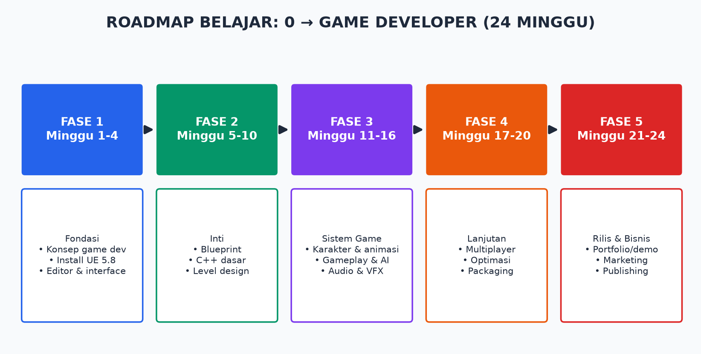

# 🎮 Game Developer Bootcamp — Zero to Hero dengan Unreal Engine 5.8

> Kurikulum lengkap 24 minggu: dari **tidak tahu apa-apa** sampai mampu **membuat, mengembangkan, dan membesarkan game** — teknis + bisnis.

## Untuk Siapa Bootcamp Ini?

- Pemula total yang belum pernah membuat game.
- Programmer yang ingin pindah ke game development.
- Artist/desainer yang ingin memahami sisi teknis dan bisnis.
- Founder yang ingin membangun studio game.

**Prasyarat: NOL.** Semua istilah asing dijelaskan di [Glosarium](glosarium.md).

## Struktur Kurikulum

| Fase | Modul | Topik | Durasi |
|------|-------|-------|--------|
| **1. Fondasi** | [00](modul/00-pendahuluan.md) | Pendahuluan & cara pakai bootcamp | Minggu 1 |
| | [01](modul/01-dasar-game-development.md) | Dasar-dasar game development | Minggu 1–2 |
| | [02](modul/02-instalasi-setup-ue5.md) | Instalasi & setup Unreal Engine 5.8 | Minggu 3 |
| | [03](modul/03-mengenal-editor-ue5.md) | Mengenal editor UE5 | Minggu 4 |
| **2. Inti** | [04](modul/04-blueprint-visual-scripting.md) | Blueprint visual scripting | Minggu 5–6 |
| | [05](modul/05-cpp-untuk-ue5.md) | C++ untuk UE5 | Minggu 7–8 |
| | [06](modul/06-level-design-world-building.md) | Level design & world building (Nanite, Lumen) | Minggu 9–10 |
| **3. Sistem Game** | [07](modul/07-karakter-dan-animasi.md) | Karakter & animasi | Minggu 11–12 |
| | [08](modul/08-gameplay-systems.md) | Gameplay systems, AI, UI, save game | Minggu 13–14 |
| | [09](modul/09-audio-dan-vfx.md) | Audio (MetaSounds) & VFX (Niagara) | Minggu 15–16 |
| **4. Lanjutan** | [10](modul/10-multiplayer-networking.md) | Multiplayer & networking | Minggu 17–18 |
| | [11](modul/11-optimasi-dan-packaging.md) | Optimasi, profiling, packaging | Minggu 19–20 |
| **5. Rilis & Bisnis** | [12](modul/12-bisnis-game.md) | Bisnis game: monetisasi, marketing, publishing, legal | Minggu 21–24 |

## Dokumen Pendukung

| Dokumen | Isi |
|---------|-----|
| [📖 Glosarium](glosarium.md) | 100+ istilah asing dijelaskan bahasa manusia |
| [🔥 Unpopular Opinions](unpopular-opinions.md) | Pendapat kontroversial dari lapangan yang jarang dikatakan |
| [📚 Referensi & Dokumen Terkait](referensi-dokumen.md) | Link dokumentasi resmi, buku, channel, komunitas, tools |
| [📄 Template GDD](templates/gdd-template.md) | Template Game Design Document siap pakai |
| [💰 Template Budget & Rencana Bisnis](templates/rencana-bisnis-template.md) | Template perencanaan biaya & bisnis game indie |
| [📊 Slide Presentasi](slides/) | Versi PPTX bootcamp (untuk mengajar/presentasi) |

## Cara Menggunakan Bootcamp Ini

1. **Ikuti urutan modul.** Setiap modul membangun di atas modul sebelumnya.
2. **Kerjakan latihan di akhir tiap modul.** Membaca ≠ bisa. Praktik = bisa.
3. **Buka Glosarium** setiap ketemu istilah asing (istilah asing di-*miringkan* saat pertama muncul).
4. **Proyek capstone:** mulai Modul 4, kamu membangun 1 game kecil yang berkembang terus sampai Modul 12 dan dirilis (minimal ke itch.io).

## Prinsip Bootcamp

1. **Selesai > sempurna.** Game jelek yang rilis mengalahkan game sempurna yang tidak pernah selesai.
2. **Scope kecil.** Musuh nomor satu pemula adalah ambisi MMORPG.
3. **Teknis dan bisnis dua kaki yang sama penting.** Game bagus tanpa marketing = tidak ada yang main.
4. **Iterasi.** Playtest sejak minggu pertama, bukan setelah "jadi".

## Catatan Versi

Materi ini ditulis untuk **Unreal Engine 5.8**. Konsep inti (Blueprint, gameplay framework, Nanite, Lumen, Niagara, MetaSounds, World Partition) stabil sejak UE 5.0 — materi tetap relevan untuk versi 5.x mana pun. Perbedaan antarversi minor dicatat di modul terkait.

---
*Dibuat untuk repo `thrive-cc`. Lisensi materi: bebas dipakai untuk belajar dan mengajar.*
