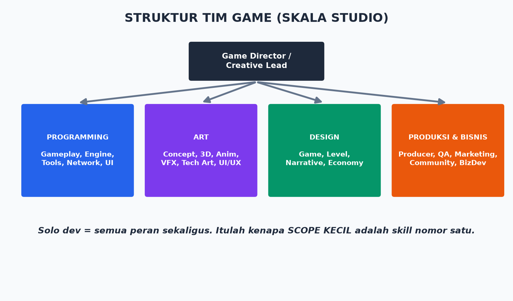

# Modul 00 — Pendahuluan: Peta Perjalananmu

> **Target modul:** paham apa yang akan kamu pelajari, kenapa urutannya begini, dan mindset yang benar sebelum mulai.

## 0.1 Apa Itu "Menjadi Game Developer"?

Game developer bukan satu profesi — dia payung untuk banyak peran:

| Peran | Tugas Utama | Skill Kunci |
|-------|------------|-------------|
| Gameplay Programmer | Logika permainan (gerakan, combat, skill) | C++, Blueprint, matematika |
| Engine/Tools Programmer | Sistem inti & tools internal | C++ dalam, arsitektur |
| Game Designer | Aturan main, balancing, *game feel* | Sistem, psikologi pemain |
| Level Designer | Menyusun dunia & tantangan | Komposisi, pacing |
| 3D/2D Artist | Model, tekstur, konsep | Blender/Maya, Substance |
| Animator | Gerakan karakter | Rigging, *state machine* |
| Technical Artist | Jembatan art ↔ programming | Shader, pipeline, optimasi |
| Audio Designer | Musik & efek suara | DAW, MetaSounds |
| Producer | Jadwal, prioritas, tim | Manajemen proyek |
| QA / Tester | Menemukan bug secara sistematis | Ketelitian, reproduksi bug |

**Solo developer = semua peran di atas sekaligus.** Bootcamp ini melatih kamu jadi *generalist* dulu (bisa semua secukupnya), baru nanti kamu pilih spesialisasi.

## 0.2 Kenapa Unreal Engine 5.8?

- **Gratis** sampai game-mu menghasilkan USD 1 juta/tahun (royalti 5% setelahnya — cek EULA terbaru).
- **Kualitas AAA out-of-the-box:** *Nanite* (geometri detail tak terbatas), *Lumen* (pencahayaan global real-time), *MetaHuman* (karakter manusia realistis).
- **Blueprint:** bikin game tanpa menulis kode — jembatan sempurna untuk pemula.
- **C++** saat kamu butuh kontrol dan performa penuh.
- **Dipakai industri:** Fortnite, Black Myth: Wukong, Satisfactory, film/serial (The Mandalorian) — skill UE5 laku di pasar kerja.

Alternatif (Unity, Godot, GameMaker) valid — dibahas di [Modul 01](01-dasar-game-development.md). Bootcamp ini memilih satu engine dan mendalaminya, karena **dalam > lebar**.

## 0.3 Struktur Belajar 24 Minggu

Lihat diagram di [README](../README.md). Ringkasnya:

1. **Fase 1 (mg 1–4): Fondasi** — konsep, install, kenal editor.
2. **Fase 2 (mg 5–10): Inti** — Blueprint, C++, level design.
3. **Fase 3 (mg 11–16): Sistem game** — karakter, gameplay, AI, audio, VFX.
4. **Fase 4 (mg 17–20): Lanjutan** — multiplayer, optimasi, packaging.
5. **Fase 5 (mg 21–24): Rilis & bisnis** — marketing, publishing, monetisasi, legal.

**Proyek capstone:** *third-person action mini-game* — 1 level, 1 karakter, combat sederhana, musuh AI, menu, save, dirilis ke itch.io. Dibangun bertahap dari Modul 4.

## 0.4 Kebutuhan Waktu & Hardware

- **Waktu:** minimal 10–15 jam/minggu. Konsisten 1 jam/hari mengalahkan 10 jam sekali seminggu.
- **Hardware minimal UE 5.8:** CPU 6-core, RAM 32 GB (16 GB bisa tapi berat), GPU dengan dukungan DX12/SM6 (NVIDIA RTX 2070+/AMD RX 6600+ untuk Lumen/Nanite nyaman), SSD 250 GB kosong.
- Spek pas-pasan? Tetap bisa — matikan Lumen, pakai *Scalability* Low. Dibahas di Modul 02.

## 0.5 Mindset yang Benar (Baca Ulang Saat Frustrasi)

1. **Kamu akan merasa bodoh — itu normal.** UE5 raksasa. Tidak ada yang menguasai semuanya, termasuk engineer Epic.
2. **Tutorial hell itu nyata.** Menonton 100 tutorial ≠ bisa. Rasio sehat: 1 jam nonton, 3 jam praktik.
3. **Selesaikan game jelek.** Game pertamamu akan jelek. Rilis juga. Pelajaran dari merilis 1 game jelek > 5 tahun mengerjakan "masterpiece" yang tak pernah selesai.
4. **Ukur progres dengan build yang bisa dimainkan,** bukan jumlah fitur setengah jadi.
5. **Komunitas itu multiplier.** Gabung Discord/forum (daftar di [Referensi](../referensi-dokumen.md)) — bertanya dengan baik adalah skill.

## 0.6 Cara Membaca Materi Ini

- Istilah asing di-*miringkan* saat pertama muncul → definisi lengkap di [Glosarium](../glosarium.md).
- Blok `kode` = ketik persis.
- 💡 = tips. ⚠️ = jebakan umum. 🔥 = unpopular opinion singkat (versi panjang di [dokumen khusus](../unpopular-opinions.md)).
- Setiap modul ditutup **Latihan** + **Checklist paham**.

## Latihan Modul 00

1. Tulis 3 game favoritmu dan JELASKAN kenapa menyenangkan (mekanik, bukan grafis).
2. Tentukan target: hobi / kerja di studio / bikin studio sendiri. Tulis. Ini menentukan fokusmu di Fase 5.
3. Buat akun: [Epic Games](https://www.epicgames.com/), [itch.io](https://itch.io/), [GitHub](https://github.com/).

## Checklist Paham

- [ ] Aku tahu peran-peran dalam game development.
- [ ] Aku tahu kenapa memilih UE 5.8 dan konsekuensinya.
- [ ] Aku tahu proyek capstone yang akan kubangun.
- [ ] Hardware-ku memenuhi syarat (atau aku tahu workaround-nya).

➡️ Lanjut: [Modul 01 — Dasar Game Development](01-dasar-game-development.md)
