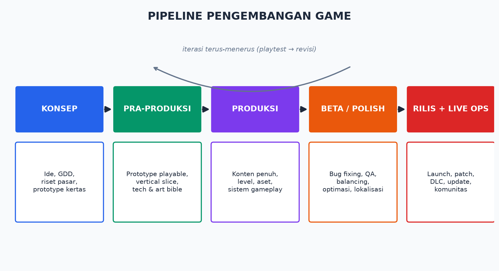

# Modul 01 — Dasar-Dasar Game Development

> **Target modul:** paham cara game bekerja di balik layar, kosakata industri, pipeline pengembangan, dan lanskap engine.

## 1.1 Apa Itu Game, Secara Teknis?

Semua game — dari Pong sampai Elden Ring — adalah **loop tak berujung**:

```
while (game_berjalan) {
    1. INPUT   → baca aksi pemain (keyboard, gamepad, sentuhan)
    2. UPDATE  → jalankan logika: fisika, AI, skor, animasi
    3. RENDER  → gambar frame baru ke layar
}
```

Loop ini disebut *game loop* dan berjalan puluhan kali per detik. Satu putaran = satu *frame*. Kecepatannya diukur dalam *FPS* (frames per second):

- **30 FPS** = 33,3 ms per frame (standar minimal konsol)
- **60 FPS** = 16,7 ms per frame (standar PC/kompetitif)
- **120+ FPS** = esports/VR

⚠️ Karena kecepatan frame bervariasi antar-komputer, logika game harus dikali *delta time* (waktu sejak frame sebelumnya) — kalau tidak, game jalan lebih cepat di PC kencang. UE5 menyediakan ini otomatis; kamu akan sering ketemu `DeltaSeconds`.

## 1.2 Anatomi Sebuah Game

| Lapisan | Isi | Contoh di UE5 |
|---------|-----|----------------|
| **Engine** | Game loop, rendering, fisika, audio, input | Unreal Engine 5.8 |
| **Sistem gameplay** | Aturan & mekanik | Blueprint / C++ milikmu |
| **Konten** | Level, model, tekstur, suara, animasi | *Assets* di Content Browser |
| **Data** | Konfigurasi, save, statistik | DataTable, SaveGame |

**Engine** = mesin mobil. **Game-mu** = mobil utuh. Kamu tidak membangun mesin dari nol (kecuali kamu studio besar / masokis — lihat 🔥 [Unpopular Opinions](../unpopular-opinions.md#bikin-engine-sendiri)).

## 1.3 Pipeline Pengembangan Game



1. **Konsep** — ide → *GDD* (Game Design Document, [template di sini](../templates/gdd-template.md)) → riset pasar.
2. **Pra-produksi** — *prototype* (versi kasar untuk uji "apakah ini seru?") → *vertical slice* (satu potongan kecil game dengan kualitas final).
3. **Produksi** — fase terpanjang: bikin semua konten & sistem. Milestone: *alpha* (semua fitur ada, kasar) → *beta* (konten lengkap, fokus bug).
4. **Polish/Beta** — QA, *balancing*, optimasi, lokalisasi, sertifikasi platform.
5. **Rilis + Live Ops** — launch, patch, update, DLC, komunitas.

💡 **Kenyataan penting:** pipeline ini tidak linear. Playtest di tiap fase sering melempar kamu mundur. Itu bukan kegagalan — itu proses kerjanya.

## 1.4 Genre & Scope — Pelajaran Paling Mahal

Estimasi kasar kesulitan untuk developer solo/tim kecil:

| Scope | Genre Contoh | Estimasi Solo Dev |
|-------|-------------|-------------------|
| 🟢 Kecil | Puzzle, arcade, endless runner, walking sim | 1–6 bulan |
| 🟡 Sedang | Platformer, top-down shooter, roguelike ringan | 6–18 bulan |
| 🟠 Besar | Metroidvania penuh, RPG kecil, sim/tycoon | 1,5–3 tahun |
| 🔴 Jangan (dulu) | Open world, MMO, extraction shooter, "seperti GTA tapi..." | Tim 50+ orang, 4+ tahun |

🔥 **Aturan scope:** perkirakan waktu pengerjaan → kalikan 3. Masih terasa sanggup? Baru mulai.

## 1.5 Lanskap Game Engine

| Engine | Kekuatan | Kelemahan | Cocok Untuk |
|--------|----------|-----------|-------------|
| **Unreal Engine 5.8** | Grafis top, Blueprint, gratis s/d $1jt, standar AAA | Berat, build lama, learning curve C++ | 3D realistis, aksi, tim serius |
| **Unity** | Ekosistem besar, C#, mobile kuat | Kualitas visual butuh usaha, kepercayaan komunitas sempat goyah (isu runtime fee 2023) | Mobile, 2D/3D umum |
| **Godot** | Open source, ringan, GDScript mudah | Ekosistem 3D lebih muda | 2D, indie, idealis FOSS |
| **GameMaker** | 2D tercepat untuk jadi | Terbatas di 3D | 2D murni (Undertale, Hotline Miami) |

Bootcamp ini = UE 5.8. Konsep (game loop, aset, scene graph) berlaku universal — pindah engine nanti tidak mulai dari nol.

## 1.6 Kosakata Wajib Minggu Pertama

Semua ada di [Glosarium](../glosarium.md), tapi 10 ini hafalkan sekarang: *engine, asset, build, prototype, GDD, mekanik, iterasi, playtest, milestone, scope creep*.

## 1.7 Dari Mana Uang Game Berasal? (Preview Fase 5)

Premium (bayar sekali), *free-to-play* + *IAP*, subscription/Game Pass, DLC, iklan (mobile). Detail penuh + strategi di [Modul 12](12-bisnis-game.md). Yang perlu kamu tahu sekarang: **model bisnis memengaruhi desain game sejak hari pertama** — game F2P didesain berbeda dari premium.

## Latihan Modul 01

1. Pilih 1 game sederhana yang kamu kenal (mis. Flappy Bird). Tulis game loop-nya: apa input, update, render-nya?
2. Tulis konsep game capstone-mu dalam **1 paragraf** + genre + scope (harus 🟢 Kecil!). Simpan — dipakai di Modul 4.
3. Isi bagian "Ringkasan" dari [template GDD](../templates/gdd-template.md) untuk konsepmu.

## Checklist Paham

- [ ] Aku bisa menjelaskan game loop ke teman non-programmer.
- [ ] Aku paham beda engine vs game vs konten.
- [ ] Aku paham fase pipeline dan kenapa iteratif.
- [ ] Konsep capstone-ku ber-scope 🟢 Kecil.

➡️ Lanjut: [Modul 02 — Instalasi & Setup UE 5.8](02-instalasi-setup-ue5.md)
