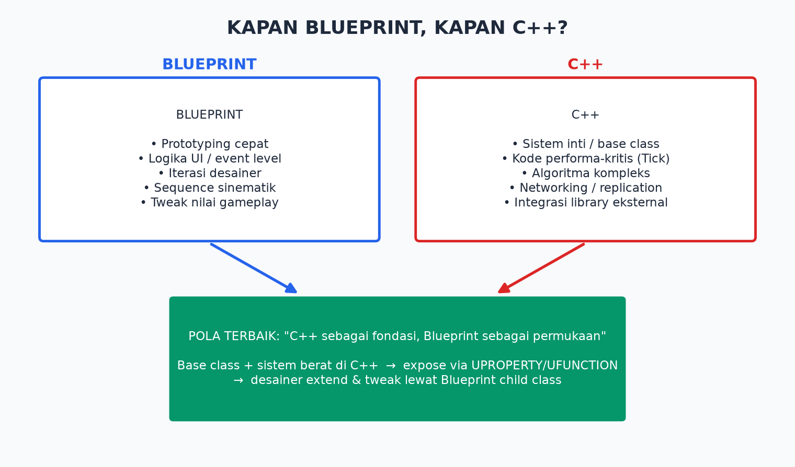

# Modul 04 — Blueprint: Membuat Game Tanpa Menulis Kode

> **Target modul:** paham logika pemrograman lewat node, bisa membuat Blueprint class, dan memulai proyek capstone.

## 4.1 Apa Itu Blueprint?

*Blueprint* = bahasa pemrograman visual UE5. Alih-alih menulis teks kode, kamu menyambungkan **node** (kotak) dengan **kabel**. Di belakang layar, Blueprint dieksekusi *virtual machine* engine — dia pemrograman sungguhan, bukan mainan: Fortnite berisi ribuan Blueprint.

🔥 **Unpopular opinion:** "Blueprint cuma untuk pemula, real dev pakai C++" — SALAH. Studio AAA memakai keduanya. Aturannya bukan gengsi tapi teknis (lihat diagram): sistem inti C++, permukaan gameplay Blueprint.

## 4.2 Konsep Pemrograman via Blueprint

Kamu sekaligus belajar konsep pemrograman universal:

| Konsep | Di Blueprint | Artinya |
|--------|--------------|---------|
| **Event** | Node merah (Event BeginPlay, Event Tick, Input) | "Ketika X terjadi..." |
| **Function/Node** | Kotak biru | "...lakukan Y" |
| **Variable** | Panel kiri (+ Variable) | Kotak penyimpan data |
| **Branch** | Node Branch (if/else) | "Kalau benar → A, salah → B" |
| **Loop** | ForLoop, WhileLoop | Ulangi N kali |
| **Cast** | Node Cast To... | "Anggap objek ini bertipe X" |

**Dua jenis kabel:**
- **Kabel putih (exec):** urutan eksekusi — "lalu kerjakan ini".
- **Kabel berwarna:** aliran data. Warna = tipe data: merah = *Boolean* (benar/salah), hijau = *Float* (angka desimal), cyan = *Integer* (bulat), pink = *String* (teks), biru = *Object*, kuning = *Vector* (X,Y,Z).

## 4.3 Blueprint Pertama: Pintu Otomatis (Step by Step)

**Tujuan:** pintu naik saat pemain dekat, turun saat menjauh.

1. **Content Browser → klik kanan → Blueprint Class → Actor** → nama `BP_PintuOtomatis` → dobel-klik.
2. **Components (kiri atas) → Add:**
   - `Static Mesh` → di Details pilih mesh (mis. `SM_Door` dari Starter Content atau kubus di-scale).
   - `Box Collision` → besarkan sampai menutupi area depan-belakang pintu (ini "sensor"-nya).
3. **Tab Event Graph.** Pilih component **Box** → panel Details → Events → klik **+** pada **On Component Begin Overlap** dan **On Component End Overlap**. Dua node event merah muncul.
4. **Logika naik:** dari `OnComponentBeginOverlap` (exec putih) → tarik kabel → ketik & pilih **Set Relative Location** (target: StaticMesh). Set nilai Z = 300.
5. **Logika turun:** dari `OnComponentEndOverlap` → **Set Relative Location** → Z = 0.
6. **Compile** (tombol kiri atas — wajib setiap perubahan!) → **Save**.
7. Drag `BP_PintuOtomatis` ke level → **Play** → dekati pintu.

**Pintu teleport, bukan bergeser halus? Bagus — upgrade:** ganti Set Relative Location dengan node **Timeline**:
1. Klik kanan graph → **Add Timeline** → nama `TL_Pintu`. Dobel-klik → **+ Track → Float Track** → nama `Alpha` → buat 2 keyframe: (waktu 0, nilai 0) dan (waktu 1, nilai 1).
2. BeginOverlap → **Play** (pin Timeline). EndOverlap → **Reverse**.
3. Dari pin **Update** → **Set Relative Location**; nilai Z = **Lerp**(0, 300, Alpha).

Sekarang pintu meluncur mulus. Kamu baru memakai *interpolation* — teknik animasi paling fundamental.

## 4.4 Variable, Function, dan Kebersihan Graph

- **Variable:** panel My Blueprint → **+** → beri nama & tipe. Contoh: `KecepatanPintu (Float)`, `SedangTerbuka (Boolean)`. Drag ke graph → **Get** (baca) / **Set** (tulis).
  - 💡 Klik variable → Details → **Instance Editable** ✅ → nilai bisa diubah per-objek di level tanpa buka Blueprint. Ini cara desainer men-tweak.
- **Function:** kumpulan node dengan input/output — dipanggil berulang. My Blueprint → Functions → **+**.
- **Kebersihan (spaghetti kills):**
  - Komentar: seleksi node → **C**.
  - Reroute node untuk merapikan kabel (dobel-klik kabel).
  - Function/Macro untuk logika yang dipakai >1 kali.
  - ⚠️ Graph berantakan hari ini = kamu sendiri tersesat 2 minggu lagi.

## 4.5 Komunikasi Antar-Blueprint (Konsep Penting!)

Tiga cara Blueprint saling bicara — urutan dari paling sederhana:

| Cara | Kapan | Contoh |
|------|-------|--------|
| **Direct reference + Cast** | Hubungan jelas & pasti | Tombol tahu pintunya: variable `PintuTarget` |
| **Interface (BPI)** | Banyak tipe objek merespons hal sama | Semua benda "bisa di-interact": BPI_Interact |
| **Event Dispatcher** | Satu memberi tahu banyak pendengar | Pintu terbuka → UI, suara, achievement mendengar |

⚠️ Jebakan pemula: **Cast ke mana-mana** membuat semua Blueprint saling bergantung (semua ter-load ke memori). Mulai biasakan Interface sejak sekarang.

## 4.6 Debugging Blueprint

- **Print String** — node sahabat: cetak teks ke layar. Taruh di mana pun kamu bingung.
- **Breakpoint:** klik kanan node → Add Breakpoint → Play → eksekusi berhenti di node itu, kabel menyala menunjukkan alur.
- Saat Play, buka Blueprint → pilih instance di dropdown atas → lihat nilai variable **live**.
- Ada error saat Compile? Baca pesannya — 90% menyebut node persisnya.

## 4.7 Memulai Capstone

Buat proyek BARU dari template **Third Person (Blueprint)** → nama sesuai game-mu. Terapkan:
1. Struktur folder + naming convention (Modul 03).
2. Git + LFS (Modul 02).
3. Buka `BP_ThirdPersonCharacter` — baca node input & movement yang sudah ada. Kamu sekarang bisa membacanya!

## Latihan Modul 04

1. Selesaikan pintu otomatis + Timeline.
2. **Lampu interaktif:** `BP_Lampu` — tekan E saat dekat untuk on/off (pakai Input Action + Point Light component + Boolean `Menyala` + Branch + **Toggle Visibility**).
3. **Coin pickup:** `BP_Koin` — overlap → suara (node **Play Sound 2D**) → **Destroy Actor**. Tambah variable skor di karakter, +1 per koin, tampilkan dengan Print String.
4. **Tantangan:** buat `BPI_Interact` (interface) dengan function `Interact`; lampu & pintu mengimplementasikannya; karakter menekan E → panggil `Interact` pada apa pun di depannya (node **Line Trace** + **Does Implement Interface**).

## Checklist Paham

- [ ] Aku paham event, exec pin, data pin, variable, branch.
- [ ] Aku bisa membuat Actor Blueprint dengan component + logika overlap.
- [ ] Aku bisa memakai Timeline untuk gerakan halus.
- [ ] Aku tahu 3 cara komunikasi antar-Blueprint dan bahaya over-Cast.
- [ ] Aku bisa debug dengan Print String & breakpoint.

➡️ Lanjut: [Modul 05 — C++ untuk UE5](05-cpp-untuk-ue5.md)
