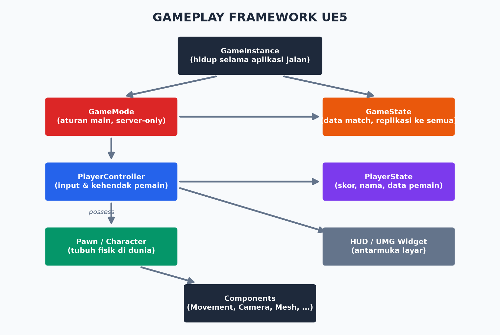

# Modul 08 — Gameplay Systems: AI, UI, Save, dan Arsitektur Game

> **Target modul:** menguasai gameplay framework, musuh AI, UI/UMG, save system — dan menyatukannya jadi game utuh.

## 8.1 Gameplay Framework: Kerangka Resmi UE

| Class | Peran | Aturan Praktis |
|-------|-------|----------------|
| **GameInstance** | Hidup sepanjang aplikasi (lintas level) | Data yang selamat dari ganti map: settings, profil |
| **GameMode** | Aturan main; **hanya ada di server** | Spawn pemain, menang/kalah, skor pertandingan |
| **GameState** | Data match yang semua orang tahu | Waktu ronde, skor tim |
| **PlayerController** | Kehendak pemain; 1 per pemain | Input, buka UI, kamera |
| **PlayerState** | Data pemain yang orang lain perlu tahu | Nama, skor, ping |
| **Pawn/Character** | Tubuh fisik | Gerak, collision, mesh — bisa mati & respawn |
| **HUD/Widget** | Layar | Healthbar, menu |

💡 **Kenapa dipisah-pisah?** Karakter mati → Pawn hancur, tapi PlayerController & PlayerState selamat → respawn mulus, skor tidak hilang. Multiplayer (Modul 10) memaksa disiplin ini; ikuti sejak sekarang agar tidak menulis ulang.

Set class-mu: **Project Settings → Maps & Modes** atau `World Settings` per level (GameMode Override).

## 8.2 Enhanced Input: Input Modern UE5

Sistem lama (axis/action mapping) deprecated. UE 5.8 = **Enhanced Input**:

- **Input Action (IA_)** — "apa": IA_Lompat (bool), IA_Gerak (Vector2D), IA_Serang.
- **Input Mapping Context (IMC_)** — "tombol apa memicu apa": IMC_Gameplay memetakan Space→IA_Lompat, WASD→IA_Gerak. 
- **Modifier/Trigger** — negate, swizzle (untuk WASD), hold, tap, chord.
- Runtime: `Add Mapping Context` (di BeginPlay PlayerController/Character). Ganti konteks = ganti mode kontrol (jalan kaki vs nyetir vs menu) — tinggal add/remove IMC. Rebinding tombol juga lewat sini.

## 8.3 Musuh AI (Step by Step)

Stack AI UE: **AIController** (otak) + **Behavior Tree** (keputusan) + **Blackboard** (memori) + **NavMesh** (peta jalan) + **AI Perception** (indera).

**Setup dasar:**
1. **NavMesh:** taruh **NavMeshBoundsVolume** menutupi area jalan musuh. Tekan **P** — area hijau = bisa dilalui.
2. `BP_Musuh` (child Character) + `AIC_Musuh` (child AIController). Di BP_Musuh → Details → AI Controller Class = AIC_Musuh.
3. **Blackboard `BB_Musuh`:** key `TargetActor (Object)`, `LokasiPatroli (Vector)`.
4. **Behavior Tree `BT_Musuh`:** Root → **Selector** ("pilih yang pertama berhasil"):
   - Cabang 1 (ada TargetActor?): **Sequence** → Move To TargetActor → Play Montage serang.
   - Cabang 2 (fallback): Sequence → cari titik acak (task `FindRandomLocation`) → Move To → Wait 3s.
   - **Decorator** (Blackboard Based Condition) di cabang 1: `TargetActor Is Set`; ✅ observer aborts → musuh langsung bereaksi saat melihat/kehilangan target.
5. **AI Perception** di AIC_Musuh: Add AIPerception component → Sight config → event `OnTargetPerceptionUpdated` → set/clear `TargetActor` di blackboard.
6. AIC_Musuh BeginPlay → **Run Behavior Tree** `BT_Musuh`.

Hasil: musuh patroli, melihatmu → mengejar & menyerang, kehilanganmu → kembali patroli. Itu AI game 90% kasus.

🔥 AI game = **ilusi kecerdasan**, bukan kecerdasan. Musuh yang sengaja menembak meleset dulu, berteriak "aku ke kanan!", dan ragu 0,3 detik terasa LEBIH cerdas daripada aimbot sempurna — karena pemain bisa membacanya.

## 8.4 UI dengan UMG (Unreal Motion Graphics)

1. Klik kanan → User Interface → **Widget Blueprint** → `WBP_HUD`.
2. **Designer tab:** drag dari Palette — `Canvas Panel` (posisi bebas), `Horizontal/Vertical Box` (susunan otomatis), `Progress Bar` (healthbar!), `Text`, `Button`, `Image`.
   - **Anchor** WAJIB dipahami: menentukan widget "menempel" ke bagian layar mana → UI aman di semua resolusi. Healthbar → anchor kiri-atas. Menu → tengah.
3. **Binding data — cara benar:** hindari *property binding* (dievaluasi tiap frame, boros). Pakai **event**: `HealthComponent` punya event dispatcher `OnHealthChanged` → WBP subscribe → update Progress Bar hanya saat berubah.
4. Tampilkan: PlayerController/Character BeginPlay → **Create Widget** `WBP_HUD` → **Add to Viewport**.
5. **Menu & mode input:** `Set Input Mode UI Only` + `Show Mouse Cursor` saat menu; `Game Only` saat main. Pause: node **Set Game Paused** (+ widget centang *Is Focusable*).

## 8.5 Save & Load

1. Blueprint class → parent **SaveGame** → `SG_Save`. Variables: `PosisiPemain (Transform)`, `Health (Float)`, `Level (Name)`, `Koin (Int)`.
2. Simpan: `Create Save Game Object` → isi variables → **Save Game to Slot** ("Slot1", user 0).
3. Muat: **Does Save Game Exist?** → **Load Game from Slot** → Cast ke SG_Save → terapkan.
4. Logika save/load taruh di **GameInstance** (selamat lintas level).
5. ⚠️ Rencanakan *versioning*: tambah var `SaveVersion (Int)` sejak awal — save lama pemain jangan korup saat game-mu update.

## 8.6 Data-Driven Design: DataTable & Data Asset

Jangan hardcode statistik di Blueprint:
- **Struct** `FItemData`: Nama, Ikon, Harga, Damage → **DataTable** `DT_Items` (bisa edit seperti Excel, bahkan import CSV — desainer/balancer tidak perlu menyentuh Blueprint).
- **Primary Data Asset** untuk definisi konten lebih kompleks (karakter, senjata).
- Manfaat: balancing = edit tabel, bukan buka 30 Blueprint.

## 8.7 Arsitektur: Menghindari Spaghetti

- **Komposisi > inheritance dalam:** kemampuan = component (HealthComponent, InventoryComponent, InteractComponent) — pasang-copot bebas.
- **Event dispatcher > Tick polling:** jangan cek `IsDead?` tiap frame; dengarkan `OnDeath`.
- **Interface > Cast** (Modul 04) untuk komunikasi lintas tipe.
- **Satu arah dependensi:** UI tahu gameplay; gameplay TIDAK tahu UI. (Gameplay memancarkan event, UI mendengarkan.)
- 💡 Ada juga **Gameplay Ability System (GAS)** — framework resmi untuk skill/buff/atribut kompleks ala MOBA/RPG. Kuat tapi kurvanya terjal; untuk capstone TIDAK perlu. Tahu namanya cukup, dalami saat game-mu penuh skill & status effect.

## Latihan Modul 08 — Game Capstone Menyatu

1. Rapikan arsitektur: GameMode (aturan), GameInstance (save), komponen health di pemain & musuh.
2. Musuh AI penuh (patroli → kejar → serang) + 3 spawn point di level.
3. HUD: healthbar (event-driven!) + counter koin/skor.
4. Main menu (level terpisah): New Game, Continue (muncul bila ada save), Quit.
5. Pause menu: Resume, Save, Quit to Menu.
6. Kondisi menang (capai goal / kalahkan semua musuh) + kalah (health 0) → layar hasil → restart/menu.
7. Statistik musuh & pickup → DataTable.

**Milestone: game-mu sekarang PLAYABLE end-to-end** — menu → main → menang/kalah → ulang. 🎉

## Checklist Paham

- [ ] Aku tahu peran tiap class gameplay framework & di mana menaruh logika.
- [ ] Input pakai Enhanced Input (IA + IMC).
- [ ] Aku bisa membangun AI: BT + Blackboard + Perception + NavMesh.
- [ ] UI-ku event-driven dengan anchor benar.
- [ ] Save/load jalan dan siap versioning.
- [ ] Aku memakai komposisi + event + interface, bukan Cast & Tick di mana-mana.

➡️ Lanjut: [Modul 09 — Audio & VFX](09-audio-dan-vfx.md)
