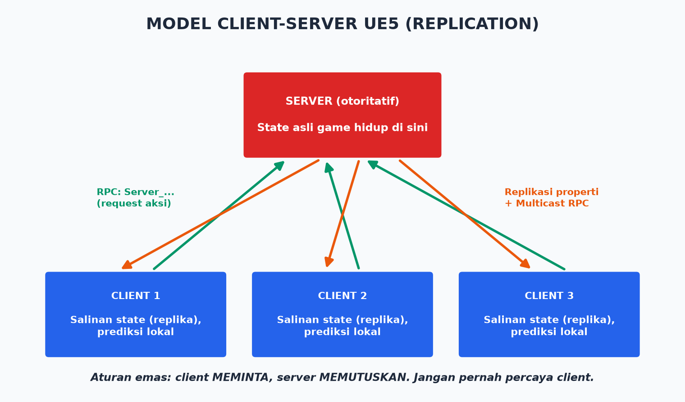

# Modul 10 — Multiplayer & Networking

> **Target modul:** paham model client-server UE, bisa mereplikasi state & memanggil RPC dengan benar, dan tahu kapan TIDAK membuat game multiplayer.

## 10.1 Peringatan Jujur Dulu

🔥 **Multiplayer melipatgandakan kesulitan game-mu 3–5×.** Setiap fitur harus dipikirkan dari sudut server, client pemilik, dan client lain. Testing lebih lama, bug lebih aneh, butuh infrastruktur. **Game pertamamu sebaiknya single-player.** Modul ini tetap wajib dipahami karena (a) arsitektur UE memang dirancang network-first, (b) kalau kamu akhirnya butuh, fondasinya sudah benar.

## 10.2 Model Client-Server UE



- **Server otoritatif** — satu-satunya kebenaran. Semua keputusan penting (damage, skor, posisi sah) terjadi di server.
- **Client** — memegang *replika* (salinan) state + mengirim niat ("aku mau maju") ke server.
- **Kenapa?** Anti-cheat & konsistensi. Client bisa dimodifikasi pemain; server tidak. **Jangan pernah percaya client.**

**Jenis server:**
- **Listen server** — satu pemain merangkap server (host). Murah, cocok co-op teman.
- **Dedicated server** — server tanpa tampilan, jalan di cloud. Standar kompetitif.

**Testing lokal:** editor → tombol Play ▼ → Number of Players: 2–3, Net Mode: *Play as Listen Server* / *Play as Client*. Dua jendela muncul — kamu bermain melawan dirimu sendiri. 💡 Console command `p.NetShowCorrections 1` dan setting **Network Emulation** (latency/packet loss buatan) = wajib sebelum percaya fiturmu "sudah jalan".

## 10.3 Replikasi Properti

*Replication* = server menyalin nilai variabel ke semua client otomatis saat berubah.

**Blueprint:** pilih variable → Details → **Replication: Replicated** (atau **RepNotify** — plus event `OnRep_NamaVar` dipanggil di client saat nilai tiba → update UI/efek di situ).

**C++:**
```cpp
UPROPERTY(ReplicatedUsing = OnRep_Health)
float Health;

UFUNCTION()
void OnRep_Health();   // dipanggil di client saat Health berubah

// wajib: daftarkan di GetLifetimeReplicatedProps
void AMyCharacter::GetLifetimeReplicatedProps(TArray<FLifetimeProperty>& OutLifetimeProps) const
{
    Super::GetLifetimeReplicatedProps(OutLifetimeProps);
    DOREPLIFETIME(AMyCharacter, Health);
}
```

Syarat: Actor-nya sendiri `bReplicates = true` (Details → Replication → Replicates ✅). Arah selalu **server → client**. Client mengubah replicated var lokal = hanya bohong ke diri sendiri.

## 10.4 RPC: Memanggil Fungsi Lintas Jaringan

| RPC | Arah | Untuk | Contoh |
|-----|------|-------|--------|
| **Server** (Run on Server) | Client → server | Meminta aksi | `Server_Serang()` |
| **Multicast** (Run on All) | Server → semua | Efek sesaat semua orang lihat | `Multicast_Ledakan()` |
| **Client** (Run on Owning Client) | Server → 1 client | Feedback pribadi | `Client_TampilkanHitmarker()` |

**Pola standar aksi pemain:**
```
Input client → Server_Serang() [+ validasi di server!]
→ server hitung damage, ubah Health (replicated)
→ RepNotify di client → healthbar update
→ Multicast_EfekSerang() → semua melihat animasi/partikel
```

⚠️ Aturan:
- RPC Server harus **divalidasi** ("boleh nggak dia menyerang sekarang?") — ingat: jangan percaya client.
- Multicast jangan untuk data penting (client yang join belakangan tidak menerimanya — pakai replicated var).
- Efek kosmetik (suara, partikel) JANGAN direplikasi sebagai state; picu via RepNotify/Multicast.

## 10.5 Ownership, Relevancy, Prediction (Konsep Lanjut, Kenali Namanya)

- **Ownership:** RPC Server hanya bisa dipanggil dari Actor yang *dimiliki* client itu (PlayerController → Pawn possess-nya).
- **Relevancy:** server hanya mengirim data Actor yang "relevan" (dekat/terlihat) ke tiap client — hemat bandwidth otomatis.
- **Client-side prediction:** gerakanmu terasa instan karena `CharacterMovementComponent` memprediksi lokal lalu dikoreksi server — gratis dari engine. Ini alasan kuat pakai Character bawaan, bukan Pawn buatan sendiri, untuk gerakan ber-network.
- **Lag compensation, rollback:** teknik menembak-di-masa-lalu ala shooter kompetitif. Tahu istilahnya cukup; engine menyediakan sebagian (cek dokumentasi terkini).

## 10.6 Sesi & Infrastruktur

- **Online Subsystem** — abstraksi platform (Steam, EOS): login, friends, lobby, matchmaking.
- **EOS (Epic Online Services)** — gratis: matchmaking, lobby, voice, anti-cheat dasar, lintas platform.
- Perjalanan koneksi: `Create Session` (host) → `Find Sessions` → `Join Session` → client `ClientTravel` ke map host.
- Dedicated server build: perlu source engine + target `Server` — proyek lanjutan, di luar scope capstone.

## Latihan Modul 10 — Prototipe Co-op Kecil (proyek terpisah, BUKAN capstone)

1. Proyek baru Third Person → set 2 players listen server. Amati: gerakan sudah tersinkron gratis (CMC prediction).
2. Replikasi health: RepNotify + healthbar di atas kepala (widget component) terlihat benar di kedua jendela.
3. Tombol serang: pola penuh Server RPC (+ validasi jarak) → damage → RepNotify → Multicast efek.
4. Pickup koin ber-network: overlap diproses HANYA di server (`Has Authority` / `Switch Has Authority`) → destroy → skor di PlayerState (replicated).
5. Uji dengan Network Emulation 150 ms — masih terasa benar?

## Checklist Paham

- [ ] Aku paham server otoritatif dan bisa menjelaskan kenapa client tak boleh dipercaya.
- [ ] Aku bisa mereplikasi variabel + RepNotify dengan benar.
- [ ] Aku hafal 3 jenis RPC dan pola input→server→replikasi→efek.
- [ ] Aku selalu cek Has Authority untuk logika penting.
- [ ] Aku sadar biaya nyata multiplayer dan menunda sampai game menuntutnya.

➡️ Lanjut: [Modul 11 — Optimasi & Packaging](11-optimasi-dan-packaging.md)
