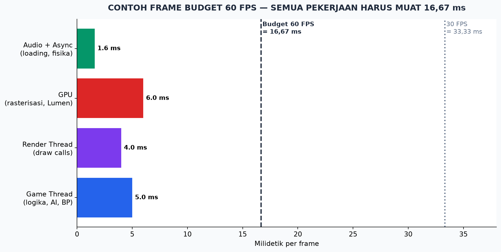

# Modul 11 — Optimasi, Profiling, dan Packaging

> **Target modul:** bisa MENGUKUR performa (bukan menebak), memperbaiki bottleneck paling umum, dan menghasilkan build yang bisa dimainkan orang lain.

## 11.1 Hukum Pertama Optimasi: UKUR DULU

⚠️ Jangan pernah mengoptimasi berdasarkan tebakan. Alur benar: **ukur → temukan bottleneck terbesar → perbaiki → ukur lagi.**

**Frame budget:** 60 FPS = seluruh pekerjaan satu frame harus selesai dalam **16,67 ms**. Pertanyaan pertama selalu: **siapa yang melebihi budget — CPU atau GPU?**

**Alat ukur bawaan (console: tombol ` / ~):**

| Command | Menampilkan |
|---------|-------------|
| `stat fps` | FPS + ms per frame |
| `stat unit` | Frame / **Game** (CPU logika) / **Draw** (CPU render) / **GPU** — angka TERBESAR = bottleneck-mu |
| `stat game` | Rincian game thread (tick, AI, fisika) |
| `stat gpu` | Rincian GPU per pass (shadow, lumen, translucency) |
| `stat scenerendering` | Draw calls, primitive |
| `stat memory` | Pemakaian memori |

**Alat besar:** **Unreal Insights** (Trace) — timeline semua thread, sesi direkam & dianalisis; **GPU Visualizer** (Ctrl+Shift+,). ⚠️ Profiling yang sah = pada **packaged build** (Development), bukan editor — editor menambah beban sendiri.

## 11.2 Resep Bottleneck Umum

**Game thread (CPU logika) berat:**
- **Tick adalah tersangka #1.** Ratusan Actor ber-Tick = mati pelan. Matikan Tick yang tak perlu (`PrimaryActorTick.bCanEverTick = false`; di BP hapus Event Tick). Ganti: **Timer** (interval), **event-driven** (dispatcher), Tick Interval > 0.
- Logika berat di Blueprint per-frame → pindah ke C++ atau kurangi frekuensi.
- Terlalu banyak overlap/collision kompleks → sederhanakan collision (box/sphere > per-poly).
- Spawn/destroy beruntun → *object pooling* (pakai ulang objek, jangan lahir-bunuh terus).

**Draw thread / draw calls tinggi:**
- 1 draw call ≈ 1 mesh × 1 material. 5.000+ = merah.
- **Instanced Static Mesh / foliage** untuk objek berulang; gabung mesh kecil-kecil; kurangi jumlah material per mesh.

**GPU berat:**
- `stat gpu` lihat pass termahal. Umum: **shadow** (kurangi lampu ber-shadow dinamis!), **Lumen** (turunkan scalability GI), **translucency/overdraw** (partikel & kaca menumpuk — lihat viewmode **Shader Complexity**: merah = bahaya).
- Resolusi: aktifkan **TSR** (Temporal Super Resolution) / DLSS / FSR — render internal lebih rendah, di-upscale cerdas. Cara modern semua game AAA.
- Tekstur kebesaran → memory. Atur **texture streaming** + max size wajar (env 1K–2K cukup untuk sebagian besar).

**Loading & memori:**
- Hard reference berlebihan (ingat Cast di Modul 04) → satu Blueprint menyeret ratusan aset ke RAM. Cek **Size Map** (klik kanan aset) & **Reference Viewer**. Pakai *soft reference* + async load untuk aset besar opsional.

**Scalability untuk pemain:** Project Settings → sediakan opsi Low/Med/High/Epic (`Engine Scalability`) di settings menu — biarkan pemain kentang tetap main.

## 11.3 Packaging: Dari Proyek ke Game

**Persiapan (Project Settings):**
- **Maps & Modes:** Game Default Map = level menu-mu.
- **Packaging:** Build Configuration — **Development** (untuk test, ada console & log) vs **Shipping** (final, bersih & cepat). ✅ *Use Pak File*; **List of maps to include** — hanya map yang dipakai (mengecilkan ukuran!).
- **Description:** nama game, versi, ikon.
- Windows: Target RHI sesuai audiens (DX12; DX11 fallback bila menyasar GPU tua — konsekuensi: tanpa Nanite/Lumen).

**Proses:** toolbar **Platforms → Windows → Package Project** → pilih folder → tunggu (lama di run pertama: cook semua aset + kompilasi shader). Hasil: folder `Windows/` berisi `.exe` — zip itu = game-mu yang dibagikan.

**Cook** = konversi aset editor ke format platform. Error packaging 90% terbaca di **Output Log**: cari baris `Error:` pertama (bukan terakhir!). Umum: map tak ada di list, plugin tak mendukung platform, blueprint error yang di editor "masih jalan".

**Uji build di mesin lain** (atau minimal folder lain / PC teman): dependency hilang, save path, resolusi — bug khas "di laptopku jalan kok".

**Platform lain:** Android/iOS perlu SDK setup (dokumen resmi); konsol perlu devkit + NDA + porting (biasanya via publisher/porting house — bahasan Modul 12).

## 11.4 Rilis Teknis: Checklist Kualitas Minimum

- [ ] Tidak crash pada 30 menit sesi normal.
- [ ] FPS stabil di spek target (tentukan spek minimum-mu & tulis di store page).
- [ ] Save/load tidak korup; Continue bekerja setelah restart aplikasi.
- [ ] Settings: resolusi, fullscreen/window, volume, scalability, rebind tombol (minimal invert/sensitivitas).
- [ ] Alt-tab tidak merusak; gamepad + keyboard dua-duanya hidup (kalau dijanjikan).
- [ ] Build Shipping, bukan Development, untuk rilis publik.

## Latihan Modul 11 — Capstone Siap Kirim

1. Profil capstone: `stat unit` → tulis bottleneck; `stat gpu` + Shader Complexity → temukan 3 biang terbesar.
2. Perbaiki minimal 3 hal (Tick liar, shadow dinamis berlebih, partikel overdraw, draw call…). Catat angka sebelum/sesudah — ini portofolio bagus!
3. Package Development build → mainkan dari .exe → perbaiki apa pun yang berbeda dari editor.
4. Package Shipping build → uji di PC lain.
5. Checklist 11.4 semua hijau → tag `v0.9` di git.

## Checklist Paham

- [ ] Aku profiling dulu, optimasi kemudian — dan tahu CPU vs GPU bound.
- [ ] Aku hafal tersangka umum: Tick, draw call, shadow, overdraw, hard reference.
- [ ] Aku bisa package Development & Shipping dan membaca error cook.
- [ ] Build-ku lolos checklist kualitas minimum di mesin orang lain.

➡️ Lanjut: [Modul 12 — Bisnis Game](12-bisnis-game.md)
