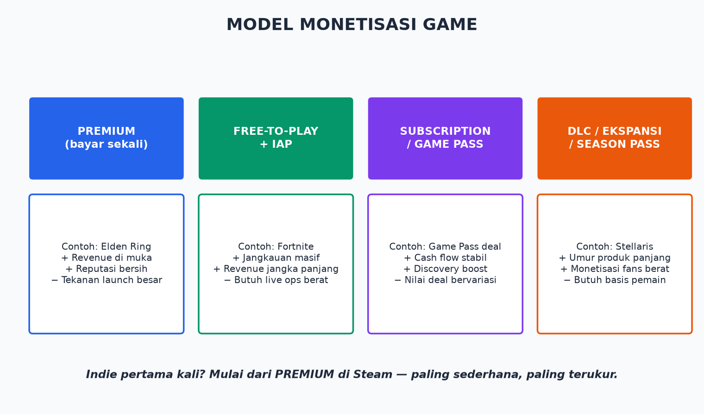
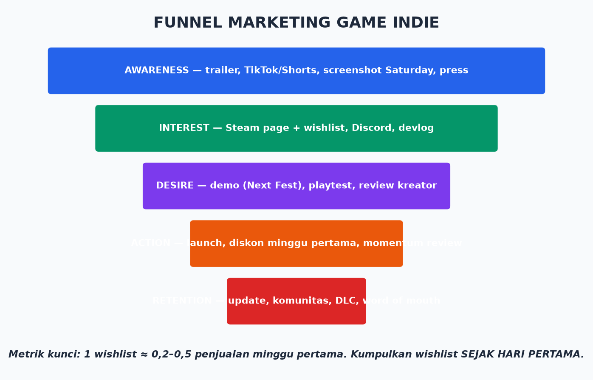

# Modul 12 — Bisnis Game: Monetisasi, Marketing, Publishing, Legal, dan Membesarkan Game

> **Target modul:** paham cara game menghasilkan uang, cara membuat orang tahu game-mu ada, jalur publishing, dasar legal, dan strategi live ops — dari indie solo sampai membangun studio.

## 12.1 Realita Pasar (Baca Sebelum Bermimpi)

- Steam menerima **14.000+ game baru per tahun**. Median pendapatan game indie: sangat kecil. Distribusi hasil = *power law*: sedikit yang meledak, mayoritas sunyi.
- **Ini bukan alasan menyerah — ini alasan bekerja dengan strategi.** Game yang gagal komersial hampir selalu gagal karena kombinasi: (a) tidak ada yang tahu game itu ada, (b) genre/pasar tidak diriset, (c) scope meledak sehingga kualitas tipis di mana-mana.
- 🔥 **Marketing bukan tahap akhir. Marketing dimulai HARI PERTAMA development** — pemilihan genre & hook adalah keputusan marketing terbesar yang kamu buat.

## 12.2 Model Monetisasi

| Model | Cocok Untuk | Kunci Sukses | Risiko |
|-------|-------------|--------------|--------|
| **Premium** (bayar sekali) | Indie pertama, game naratif/selesai | Hook jelas + wishlist banyak saat launch | Penjualan memuncak lalu turun |
| **F2P + IAP** | Tim dengan dana live-ops, mobile/kompetitif | Retensi D1/D7/D30, ekonomi in-game sehat | Butuh jutaan pemain; biaya UA tinggi |
| **Subscription/Game Pass deal** | Yang ditawari 😄 | Negosiasi; biasanya via publisher | Kanibalisasi penjualan (diperdebatkan) |
| **DLC/Ekspansi/Season** | Game dengan basis pemain hidup | Konten yang fans berat mau bayar | Perlu sukses dulu |
| **Iklan (mobile)** | Hyper-casual | Volume unduhan masif, CPI < LTV | Race to the bottom |

**Harga premium indie:** jangan takut harga wajar. $9.99–$19.99 umum untuk indie 4–10 jam. Harga terlalu murah = sinyal "murahan" + ruang diskon hilang. Diskon launch 10–15%, siklus diskon musiman Steam setelahnya.

**Istilah finansial wajib** (definisi di [Glosarium](../glosarium.md)): *revenue share* (Steam potong 30%), *gross vs net*, *LTV, CPI, ARPU, retention D1/D7/D30, conversion rate, wishlist*.

## 12.3 Marketing untuk Developer (Bukan untuk Marketer)

### Fondasi: Hook
Sebelum bicara kanal, jawab: **"Kenapa orang berhenti scroll saat melihat game-ku 3 detik?"** Hook bisa: visual unik (art style), premis satu-kalimat ("kamu adalah roti"), mekanik yang langsung terbaca di GIF. Tidak punya hook = masalah PRODUK, bukan masalah marketing. Uji hook SEBELUM produksi penuh (posting mockup/prototype GIF, lihat reaksi).

### Playbook Indie Premium (Steam) — Urutan Kerja
1. **Steam page naik SEDINI mungkin** (begitu punya screenshot layak) — wishlist mulai menabung. Capsule art profesional = investasi wajib (ini "sampul buku"-mu).
2. **Konten pendek rutin:** GIF/screenshot progress ke TikTok/Shorts/Reels/X/Reddit (r/IndieDev, subreddit genre). Format menang: before-after, fitur aneh, bug lucu, "day X of making...".
3. **Devlog** (YouTube/blog) — komunitas kecil tapi loyal.
4. **Discord** sejak ada demo — rumah komunitasmu.
5. **Demo + Steam Next Fest** — event wishlist terbesar untuk indie. Demo harus 20–40 menit terbaik game-mu.
6. **Kreator/press:** kirim key + press kit (1 folder: fact sheet, screenshot, GIF, trailer, logo) ke kurator/YouTuber/streamer genre-mu. Email pendek personal >> blast template.
7. **Launch:** targetkan wishlist (patokan komunitas: 7.000–10.000+ untuk masuk radar algoritma Steam; kualitas wishlist beda-beda). Minggu pertama = momentum: review awal, respons cepat ke bug, hadir di komunitas.

**Metrik yang dilacak:** wishlist/minggu, CTR capsule, media follower per kanal, demo → wishlist conversion, review positif %.

### Untuk Mobile F2P (Ringkas)
Soft launch negara kecil → ukur retensi & monetisasi → perbaiki → global + UA (user acquisition) berbayar. Permainan angka: LTV > CPI = scale. Butuh modal & analitik serius (Firebase/Adjust/AppsFlyer).

## 12.4 Publishing: Sendiri atau Dengan Publisher?

| | Self-Publish | Dengan Publisher |
|---|---|---|
| **Dapat** | 100% net revenue, kontrol penuh, kecepatan | Funding, QA, porting, lokalisasi, marketing muscle, koneksi platform/Game Pass |
| **Bayar** | Semua kerja & biaya sendiri | 20–50% revenue share (setelah *recoup* — publisher balik modal dulu) + sebagian kontrol |
| **Cocok bila** | Scope kecil, punya runway, mau belajar | Butuh dana produksi, game berpotensi tapi butuh dorongan |

**Cara pitch publisher:** vertical slice/demo kuat + pitch deck (konsep, hook, pasar, tim, budget, timeline) + build playable. Kirim saat game SUDAH terlihat menjanjikan. Daftar publisher indie & event pitching di [Referensi](../referensi-dokumen.md).

⚠️ **Baca kontrak dengan lawyer.** Red flags: IP berpindah ke publisher, recoup tak transparan, hak sekuel ikut terjual, klausul exit sepihak.

**Platform & potongannya:** Steam 30% (turun di tier penjualan tinggi), Epic Games Store 12%, itch.io (kamu pilih, default 10%), GOG 30%, App Store/Play Store 15–30%, konsol ±30% + proses sertifikasi.

## 12.5 Legal & Keuangan Dasar

- **Badan usaha:** mulai serius/terima uang → pisahkan entitas (di Indonesia: PT/PT Perorangan; konsultasikan). Rekening terpisah sejak rupiah pertama.
- **IP (kekayaan intelektual):** kamu otomatis punya hak cipta atas karyamu; **merek** (nama game/studio) perlu didaftarkan. Cek nama tidak bentrok SEBELUM cinta mati (trademark search).
- **Lisensi aset:** setiap aset beli/gratis punya lisensi — baca. "Free" ≠ boleh komersial. Musik paling sering menjebak (lisensi sync/stream — pemain streaming game-mu bisa kena claim; sediakan "streamer mode" bila musikmu berlisensi ketat).
- **EULA engine:** UE gratis s/d **USD 1 juta revenue/tahun per game**, setelah itu royalti 5% (rilis via Epic Store = royalti bebas). Cek EULA terbaru tiap rilis besar — angka bisa berubah.
- **Kontrak kerja/kontributor:** siapa pun yang menyentuh game-mu (musisi, artist freelance) → kontrak tertulis: hasil kerja = milik proyek (*work for hire*), atau lisensi jelas. Handshake deal = bom waktu saat game sukses.
- **Privasi & rating:** game online/analytics → privacy policy (GDPR/COPPA bila anak-anak). Rating: IARC (gratis, otomatis untuk banyak toko), ESRB/PEGI untuk konsol.
- **Pajak:** revenue Steam = penghasilan; pahami kewajiban lokal + form pajak AS (W-8BEN untuk non-AS, memotong withholding).

## 12.6 Funding: Dari Mana Uang Development?

Urutan paling umum untuk indie: **kerja sampingan/tabungan** → **dana hibah** (Epic MegaGrants, dana pemerintah/kreatif lokal) → **publisher advance** → **crowdfunding** (Kickstarter — sekaligus uji pasar; butuh audiens duluan!) → **investor** (jarang untuk game tunggal; relevan untuk studio/teknologi). Early Access = funding + playtest massal, TAPI hanya untuk genre yang cocok (sandbox/roguelike/sim; bukan naratif) dan build yang sudah seru.

## 12.7 Live Ops: Membesarkan Game Setelah Rilis

Rilis bukan garis finis — untuk banyak game justru garis start:
1. **Minggu 1–2:** patch cepat bug terbanyak; balas review (positif & negatif) — responsif = review naik.
2. **Bulan 1–3:** update konten pertama ("update besar bernama") → berita di Steam → pemain lama kembali + spike penjualan.
3. **Rutin:** roadmap publik, event musiman, sale Steam tiap siklus, community spotlight.
4. **Ekspansi:** DLC saat basis pemain terbukti; port platform baru (Switch/console — sering via porting partner); lokalisasi bahasa pasar besar (EFIGS + zh-CN sering menggandakan pasar).
5. **Metrik live:** DAU/MAU, retention, refund rate, review velocity. Data > perasaan.

**Membangun studio (bila itu targetmu):** sukses kecil pertama → reinvest → tim inti kecil multi-skill → pipeline proyek ke-2 sambil live ops proyek ke-1 → jangan scale gaji melebihi runway 12–18 bulan. Kematian studio #1: satu proyek besar, dana habis sebelum rilis.

## Latihan Modul 12 — Rilis Capstone Beneran

1. Isi [Template Rencana Bisnis](../templates/rencana-bisnis-template.md) untuk capstone-mu (walau rilis gratis — latihannya yang bernilai).
2. Buat press kit mini: 5 screenshot terbaik, 1 GIF gameplay, deskripsi 2 kalimat dengan hook.
3. **Rilis capstone di itch.io** (gratis/pay-what-you-want): halaman rapi, build Shipping, deskripsi + tag benar.
4. Posting di 2 komunitas (r/IndieDev "I made this", Discord UE) — kumpulkan feedback 10 orang.
5. Rancang di kertas: kalau game ini diseriuskan jadi produk Steam — apa hook-nya, siapa pemainnya, berapa harga, 3 update pertama apa?

**🎓 SELESAI:** kamu sudah melewati seluruh siklus: ide → build → polish → rilis → feedback. Itu satu putaran penuh yang kebanyakan orang tidak pernah selesaikan. Putaran berikutnya: lebih besar, lebih baik, lebih laku.

## Checklist Paham

- [ ] Aku bisa memilih model monetisasi yang cocok untuk game & kapasitasku.
- [ ] Aku paham funnel wishlist dan mulai marketing dari hari pertama.
- [ ] Aku tahu trade-off self-publish vs publisher dan red flag kontrak.
- [ ] Aku paham dasar IP, lisensi aset, EULA engine, dan kontrak kontributor.
- [ ] Aku punya rencana live ops, bukan cuma rencana launch.

⬅️ Kembali ke [README](../README.md) • Baca juga: [Unpopular Opinions](../unpopular-opinions.md), [Referensi](../referensi-dokumen.md)
